

# Darts Lab

> **Darts setup management, stats tracking, barrel discovery & community platform for darts players.**

ダーツプレイヤー向けのセッティング管理・スタッツ記録・バレル探索・コミュニティ Web アプリケーション。自身のダーツセッティングを登録・共有し、DARTSLIVE のスタッツを自動取得してグラフで成長を可視化。バレルシミュレーターや診断クイズでぴったりのバレルを見つけ、ディスカッション機能でセッティング相談や練習法を共有できます。

**Demo:** [https://darts-app-lime.vercel.app](https://darts-app-lime.vercel.app)

## Screenshots

|               ホーム               |                バレル検索                |               スタッツ               |
| :--------------------------------: | :--------------------------------------: | :----------------------------------: |
| 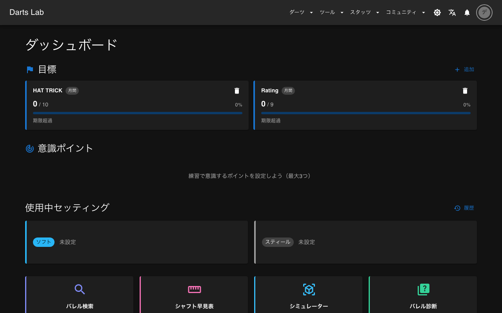 | 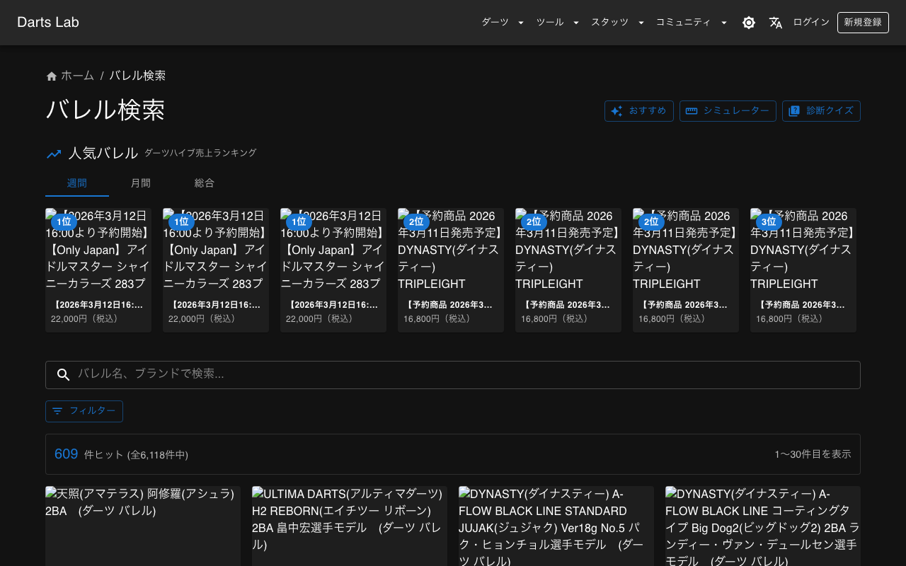 | 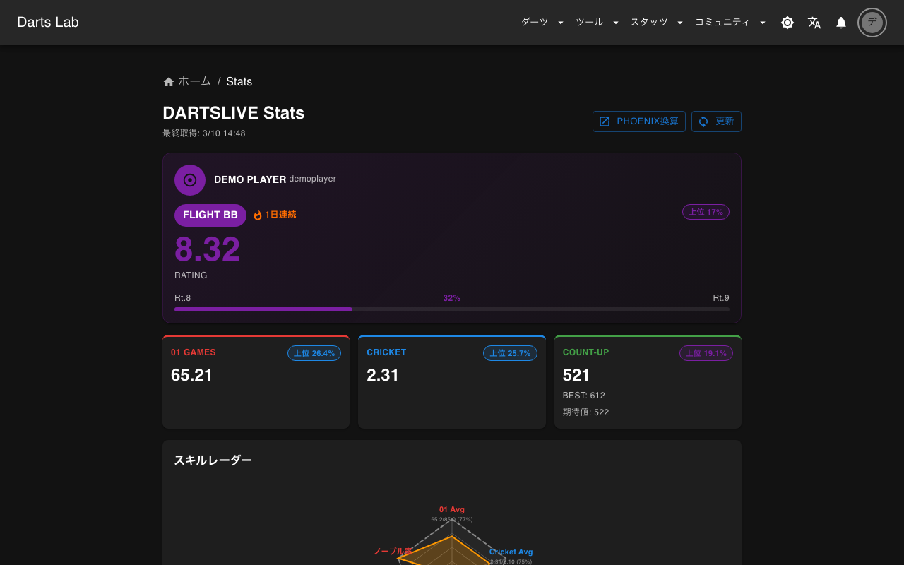 |

|           セッティング登録           |             バレルシミュレーター             |             診断クイズ             |
| :----------------------------------: | :------------------------------------------: | :--------------------------------: |
| 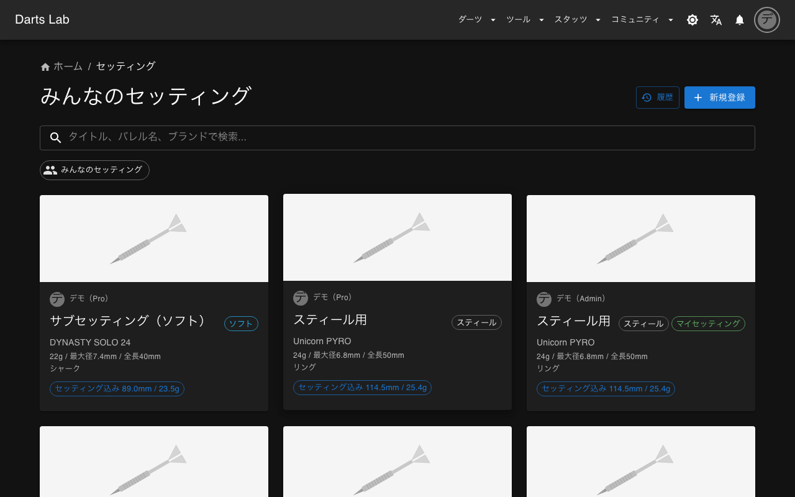 | 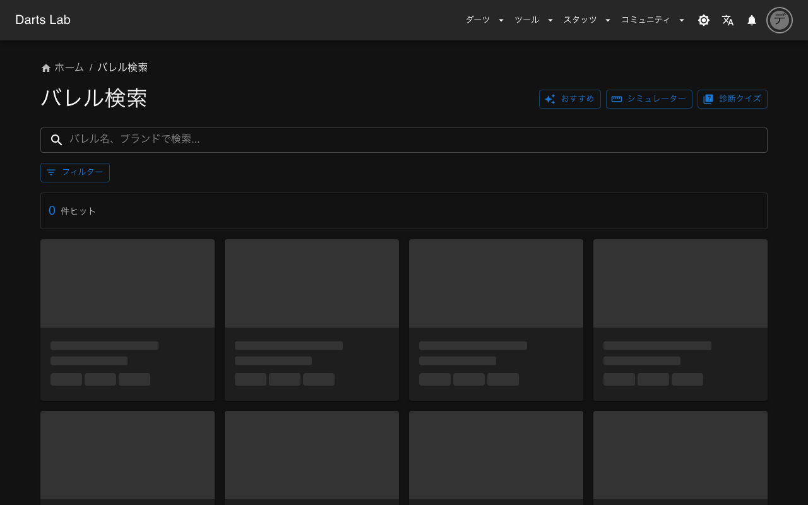 | 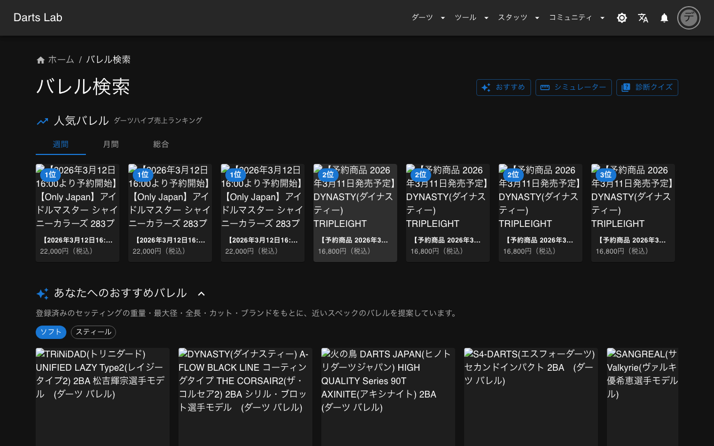 |

|             マイショップ             |                 ディスカッション                 |                 レポート                 |
| :----------------------------------: | :----------------------------------------------: | :--------------------------------------: |
| 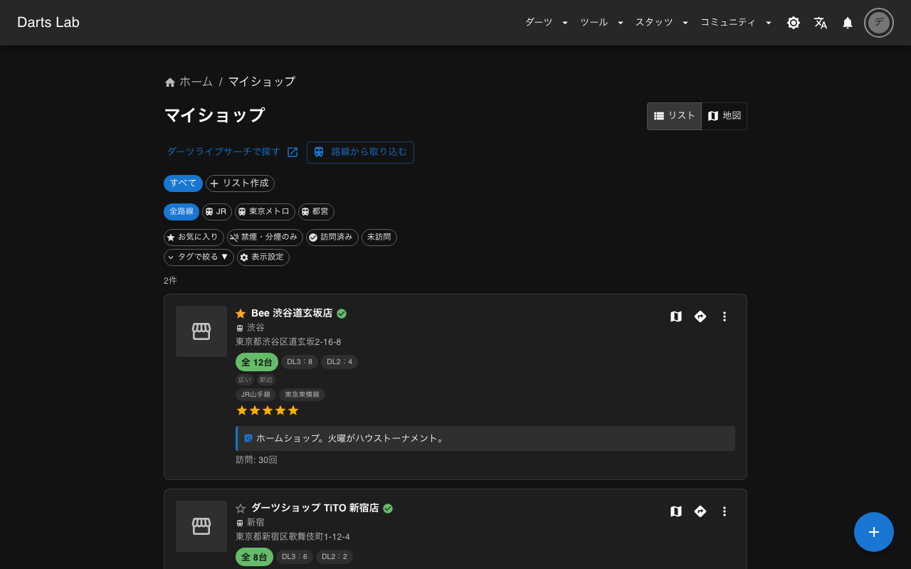 | 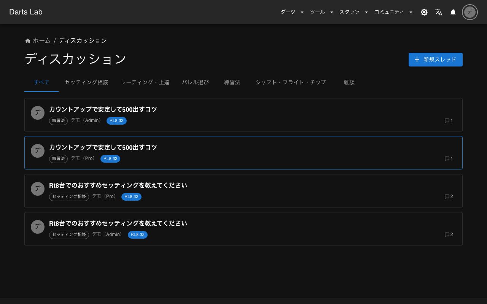 |  |

|                 カレンダー                 |             セッティング比較             |                おすすめバレル                |
| :----------------------------------------: | :--------------------------------------: | :------------------------------------------: |
| 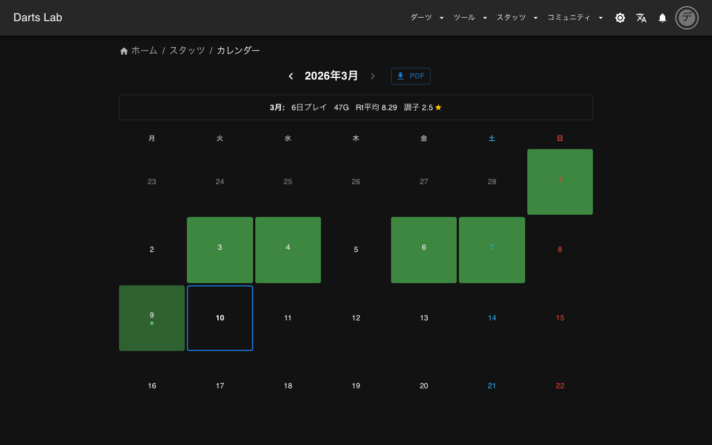 | 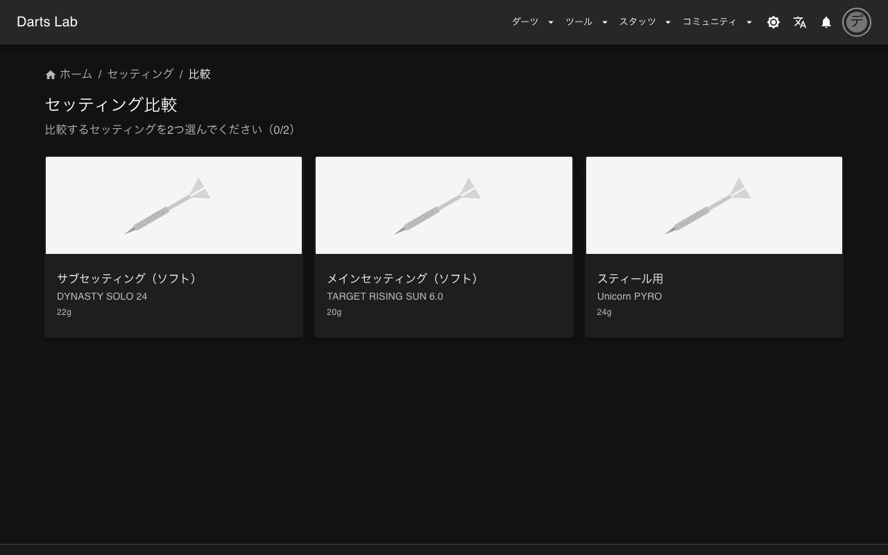 | 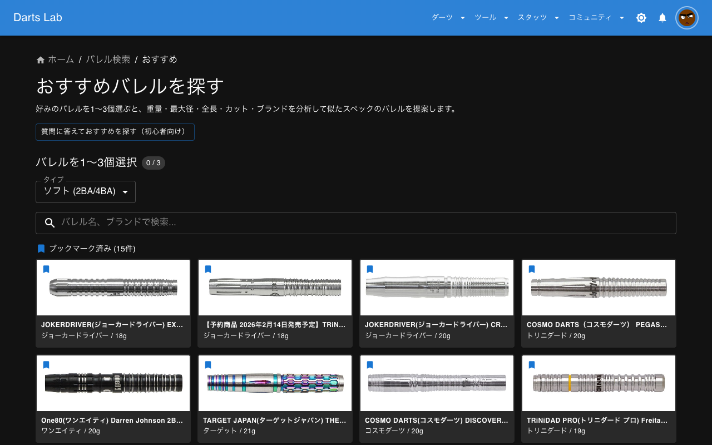 |

## 主な機能

- **セッティング管理** — バレル・チップ・シャフト・フライトの組み合わせを登録、スペック自動計算、比較、変更履歴、OGP付きシェア
- **バレル検索 & 探索** — 7,000種以上のDB、スペック横断検索、売上ランキング、実寸シミュレーター、診断クイズ、レコメンドエンジン
- **DARTSLIVE スタッツ連携 (PRO)** — 自動取得（Puppeteer）、Rating/01/Cricket/COUNT-UP の月間推移グラフ、パーセンタイル表示、ブル統計、Rt目標分析、スキルレーダー（フライト別ベンチマーク付き）、レーティングトレンドスパークライン、セッション比較、ゲーム安定度分析
- **マイショップ** — DARTSLIVE サーチ URL 貼り付けで店名・住所・駅・画像を自動登録、タグフィルター（禁煙・投げ放題等）、リスト管理、お気に入り
- **週次/月次レポート** — LINE Flex Message で自動配信（前期間比較付き）
- **XP / 経験値** — 14種のXPルール、日次Cron自動付与、30段階ランク、12種の実績
- **目標トラッキング** — 月間/年間目標の設定、DARTSLIVE スタッツからリアルタイム進捗計算、達成時にXP付与+紙吹雪演出
- **ディスカッション** — 6カテゴリの掲示板、投稿者のRt・バレル自動表示
- **記事 (admin)** — Markdown ベースの公式コンテンツ
- **アフィリエイト連携** — 6ショップ対応（ダーツハイブ・エスダーツ・MAXIM・TiTO・楽天・Amazon）
- **PWA & iOS** — Service Worker オフラインキャッシュ + Capacitor iOS ネイティブ
- **ダークモード** — OS連動 + 手動切替、FOUC防止

<b>ロール別機能一覧</b>

| 機能                                      | general（無料） | pro（有料） | admin  |
| ----------------------------------------- | :-------------: | :---------: | :----: |
| セッティング登録                          |     最大3件     |   無制限    | 無制限 |
| セッティング閲覧・いいね・コメント        |        o        |      o      |   o    |
| バレル検索・クイズ・シミュレーター        |        o        |      o      |   o    |
| セッティング比較・履歴                    |        o        |      o      |   o    |
| ディスカッション閲覧・返信                |        o        |      o      |   o    |
| ディスカッション作成                      |        x        |      o      |   o    |
| プロフィール編集                          |        o        |      o      |   o    |
| 手動スタッツ記録                          |        o        |      o      |   o    |
| DARTSLIVE連携（自動取得・グラフ・Rt目標） |        x        |      o      |   o    |
| 記事投稿・編集                            |        x        |      x      |   o    |
| ディスカッション管理（ピン留め・ロック）  |        x        |      x      |   o    |
| ユーザーロール管理                        |        x        |      x      |   o    |

## 技術スタック

| カテゴリ       | 技術                                          |
| -------------- | --------------------------------------------- |
| フレームワーク | Next.js 16 (App Router)                       |
| 言語           | TypeScript 5 (strict)                         |
| UI             | React 19, MUI v7                              |
| 認証           | NextAuth.js 4 + Firebase Authentication       |
| データベース   | Cloud Firestore                               |
| ストレージ     | Firebase Storage                              |
| 決済           | Stripe (Subscription / Webhook)               |
| グラフ         | Recharts 3                                    |
| スクレイピング | Puppeteer 24                                  |
| エラー監視     | Sentry                                        |
| テスト         | Vitest (150+ tests)                           |
| CI             | GitHub Actions (lint / format / test / build) |
| PWA            | Serwist (Workbox ベース)                      |
| モバイル       | Capacitor 8 (iOS WebView)                     |
| ホスティング   | Vercel                                        |

<b>アーキテクチャ概要</b>

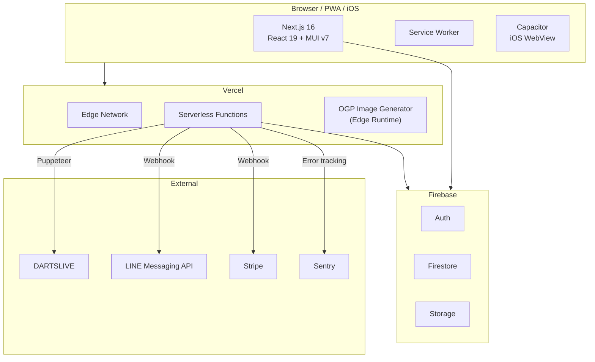

- **サーバーレスアーキテクチャ**: Vercel + Firebase による完全マネージド構成
- **JWT 認証**: NextAuth.js によるセッション管理、ロールベースアクセス制御（admin/pro/general）
- **日次 Cron バッチ**: Vercel Cron (JST 10:00) でスタッツ自動取得 → XP付与 → 実績チェック → レポート配信 — 詳細は [docs/CRON.md](docs/CRON.md)
- **独自レコメンドエンジン**: 重量(30)・径(25)・長さ(25)・カット(15)・ブランド(5)の100点スコアリング
- **Stripe課金**: Checkout → Webhook → Firestore ロール更新のサーバーサイド完結フロー
- **PWA + ネイティブ**: Serwist によるキャッシュ戦略 + Capacitor iOS 対応

詳細は [ARCHITECTURE.md](docs/ARCHITECTURE.md) を参照。

## ドキュメント

| ドキュメント                                       | 内容                                                  |
| -------------------------------------------------- | ----------------------------------------------------- |
| [アーキテクチャ設計書](docs/ARCHITECTURE.md)       | システム構成図・ページ遷移図・データフロー（Mermaid） |
| [要件定義書](docs/01-requirements.md)              | 目的・ユーザー定義・機能一覧・非機能要件              |
| [基本設計書](docs/02-basic-design.md)              | システム構成・技術選定理由・DB設計                    |
| [詳細設計書](docs/03-detailed-design.md)           | 画面設計・API設計・認証フロー・状態管理               |
| [自動処理 (Cron)](docs/CRON.md)                    | 日次バッチの処理内容・認証・データフロー              |
| [セキュリティレビュー](docs/05-security-review.md) | セキュリティ観点のレビュー結果                        |

<b>セキュリティ</b>

- Firestore / Storage セキュリティルールによるフィールドレベル制限
- レートリミット（IP ベース 60 req/min）
- タイミングセーフ署名検証（LINE Webhook）
- SSRF 防止（OG 画像生成でドメインホワイトリスト）
- SVG ブロック（画像プロキシ）、HTTPS のみ
- CSV インジェクション防止
- Stripe Webhook 署名検証 + イベント重複排除
- Sentry によるエラー監視

## ライセンス

[MIT](./LICENSE)
