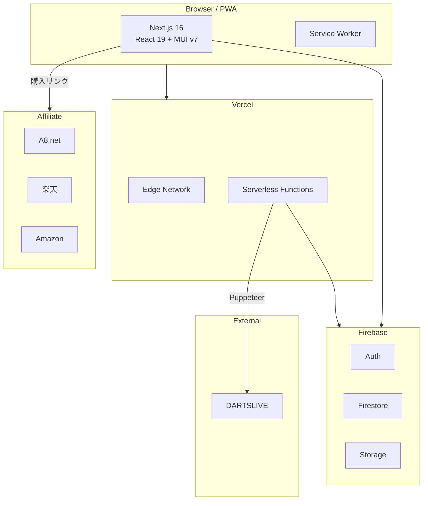

# Darts Lab

ダーツプレイヤー向けのセッティング管理・スタッツ記録・バレル探索 Web アプリケーション。

自身のダーツセッティング（バレル・シャフト・フライト・チップ）を登録・共有し、DARTSLIVE のスタッツを自動取得してグラフで成長を可視化。バレルシミュレーターや診断クイズでぴったりのバレルを見つけ、アフィリエイト連携で購入までシームレスに繋げます。

## 主な機能

### セッティング管理
- バレル・チップ・シャフト・フライトの組み合わせを登録
- 主要メーカーの製品プリセットから選択、またはカスタム入力
- CONDOR AXE（一体型パーツ）対応
- パーツ互換性チェック（シャフト × フライトの組み合わせ検証）
- スペック（重量・全長）の自動計算
- 2つのセッティングを横並びで比較
- セッティング変更履歴の記録・追跡

### バレルデータベース & 探索
- バレル製品をスペック（重量・径・長さ・カット）で横断検索
- 人気売上ランキング（週間/月間/総合タブ切替）
- **バレルシミュレーター**: SVGでバレル形状を可視化、最大3本まで重ねて比較
- **診断クイズ**: 6つの質問に答えるだけでおすすめバレルを提案（MUI Stepper）
- ユーザーの傾向に基づくレコメンドエンジン（マルチファクタースコアリング）
- ブックマーク＆検索結果からセッティング下書き作成

### DARTSLIVE スタッツ連携（PRO）
- DARTSLIVE アカウントからスタッツを自動取得（Puppeteer によるサーバーサイドスクレイピング）
- Rating / 01 / Cricket / COUNT-UP の月間推移グラフ（Recharts）
- 直近プレイデータの可視化
- 前回との比較（±表示）
- レーティング目標分析（次のRt到達に必要なPPD/MPRを算出）
- カウントアップのRt期待値基準カラー表示

### 手動スタッツ記録
- 練習の調子やメモを手動で記録・管理
- 全ユーザーが利用可能

### アフィリエイト連携 & 収益化
- ダーツハイブ（A8.net）・楽天・Amazon への購入導線
- 環境変数ベースのアフィリエイトID管理（未設定時は直リンクにフォールバック）
- 全バレルカード・詳細ページ・サイドバーにショップリンク

### ソーシャル & コンテンツ
- セッティングへのいいね・コメント・ブックマーク
- Markdown ベースのナレッジ記事投稿（PRO/admin）
- プロフィール公開/非公開設定

### PWA
- Service Worker によるオフラインキャッシュ
- モバイルでホーム画面に追加して使用可能

## ロール別機能一覧

| 機能 | general（無料） | pro（有料） | admin |
|------|:---:|:---:|:---:|
| セッティング登録 | 最大3件 | 無制限 | 無制限 |
| セッティング閲覧・いいね・コメント | o | o | o |
| バレル検索・クイズ・シミュレーター | o | o | o |
| セッティング比較・履歴 | o | o | o |
| プロフィール編集 | o | o | o |
| 手動スタッツ記録 | o | o | o |
| DARTSLIVE連携（自動取得・グラフ・Rt目標） | x | o | o |
| 記事投稿・編集（自分の記事） | x | o | o |
| 記事のおすすめフラグ設定 | x | x | o |
| ユーザーロール管理 | x | x | o |

## 技術スタック

| カテゴリ | 技術 |
|----------|------|
| フレームワーク | Next.js 16 (App Router) |
| 言語 | TypeScript 5 (strict) |
| UI | React 19, MUI v7 |
| 認証 | NextAuth.js 4 + Firebase Authentication |
| データベース | Cloud Firestore |
| ストレージ | Firebase Storage |
| グラフ | Recharts 3 |
| スクレイピング | Puppeteer 24 |
| PWA | Serwist (Workbox ベース) |
| ホスティング | Vercel |

## アーキテクチャ



- **サーバーレスアーキテクチャ**: Vercel + Firebase による完全マネージド構成
- **JWT 認証**: NextAuth.js によるセッション管理、ロールベースアクセス制御（admin/pro/general）
- **権限管理**: `lib/permissions.ts` による一元的なロール判定（セッティング上限・DARTSLIVE連携・記事投稿）
- **独自レコメンドエンジン**: 重量(30点)・径(25点)・長さ(25点)・カット(15点)・ブランド(5点)の100点スコアリング
- **SVGシミュレーター**: バレル寸法からベジエ曲線でシルエットを推定描画
- **レーティング分析**: DARTSLIVE Rt計算式に基づく目標PPD/MPR算出・均等目標提案
- **アフィリエイト基盤**: `lib/affiliate.ts` による環境変数ベースのURL変換
- **PWA**: Serwist による Workbox ベースのキャッシュ戦略

## セットアップ

### 前提条件

- Node.js 18+
- npm
- Firebase プロジェクト（Auth, Firestore, Storage を有効化）

### インストール

```bash
git clone https://github.com/<your-username>/darts-app.git
cd darts-app
npm install
```

### 環境変数

`.env.example` を `.env.local` にコピーし、各値を設定してください。

```bash
cp .env.example .env.local
```

| 変数 | 説明 |
|------|------|
| `NEXT_PUBLIC_FIREBASE_*` | Firebase クライアントSDK設定 |
| `NEXTAUTH_SECRET` | NextAuth JWT 署名キー（`openssl rand -base64 32` で生成） |
| `NEXTAUTH_URL` | アプリの URL（開発: `http://localhost:3000`） |
| `ADMIN_EMAIL` | 管理者メールアドレス |
| `NEXT_PUBLIC_RAKUTEN_AFFILIATE_ID` | 楽天アフィリエイトID（任意） |
| `NEXT_PUBLIC_AMAZON_ASSOCIATE_TAG` | AmazonアソシエイトTag（任意） |
| `NEXT_PUBLIC_A8_MEDIA_ID` | A8.net メディアID（任意） |

### 開発サーバー

```bash
npm run dev
```

`http://localhost:3000` でアプリが起動します。

### ビルド

```bash
npm run build  # Webpack モードで Service Worker も生成
```

## ディレクトリ構成

```
darts-app/
├── app/                        # Next.js App Router
│   ├── api/                    #   API エンドポイント
│   ├── darts/                  #   セッティング管理
│   ├── barrels/                #   バレル検索
│   │   ├── recommend/          #     おすすめ検索
│   │   ├── simulator/          #     シミュレーター
│   │   └── quiz/               #     診断クイズ
│   ├── stats/                  #   スタッツ記録
│   ├── articles/               #   記事
│   ├── about/                  #   サイトについて
│   ├── privacy/                #   プライバシーポリシー
│   ├── terms/                  #   利用規約
│   ├── admin/                  #   管理機能
│   ├── sw.ts                   #   Service Worker エントリ
│   └── layout.tsx              #   ルートレイアウト (PWA メタデータ)
├── components/                 # 再利用 UI コンポーネント
│   ├── layout/                 #   Header, Footer, TwoColumn, Sidebar, Breadcrumbs
│   ├── affiliate/              #   AffiliateButton
│   ├── darts/                  #   DartCard, DartDetail, DartForm
│   ├── barrels/                #   BarrelCard, BarrelSimulator, BarrelQuiz
│   ├── articles/               #   ArticleCard, MarkdownContent
│   └── comment/                #   CommentForm, CommentList
├── lib/                        # ビジネスロジック・ユーティリティ
│   ├── permissions.ts          #   ロール別権限判定ユーティリティ
│   ├── affiliate.ts            #   アフィリエイトURL変換
│   ├── recommend-barrels.ts    #   レコメンドエンジン + クイズスコアリング
│   ├── calc-totals.ts          #   スペック合計計算
│   ├── firebase.ts             #   Firebase クライアント初期化
│   ├── firebase-admin.ts       #   Firebase Admin SDK
│   └── auth.ts                 #   NextAuth 設定
├── types/                      # TypeScript 型定義
├── scripts/                    # スクレイピング・データ管理スクリプト
├── docs/                       # 設計ドキュメント
│   ├── ARCHITECTURE.md         #   アーキテクチャ設計書 (Mermaid図付き)
│   ├── 01-requirements.md      #   要件定義書
│   ├── 02-basic-design.md      #   基本設計書
│   ├── 03-detailed-design.md   #   詳細設計書
│   ├── 04-task-breakdown.md    #   タスク分解
│   └── 05-security-review.md   #   セキュリティレビュー
└── public/                     # 静的アセット
    ├── manifest.json           #   PWA マニフェスト
    └── icons/                  #   PWA アイコン
```

## 設計ドキュメント

| ドキュメント | 内容 |
|-------------|------|
| [アーキテクチャ設計書](docs/ARCHITECTURE.md) | システム構成図・ページ遷移図・データフロー（Mermaid） |
| [要件定義書](docs/01-requirements.md) | 目的・ユーザー定義・機能一覧・非機能要件 |
| [基本設計書](docs/02-basic-design.md) | システム構成・技術選定理由・DB設計 |
| [詳細設計書](docs/03-detailed-design.md) | 画面設計・API設計・認証フロー・状態管理 |
| [タスク分解](docs/04-task-breakdown.md) | 開発チェックリスト |
| [セキュリティレビュー](docs/05-security-review.md) | セキュリティ観点のレビュー結果 |

## セキュリティ

- 認証情報はサーバーサイドのみで処理し、永続化しない
- Firebase セキュリティルールによるデータアクセス制御
- 環境変数による秘密情報管理（`.env.local` は Git 管理外）
- 画像プロキシはホワイトリスト方式（許可ドメインのみ中継）
- DARTSLIVE 連携は PRO/admin ユーザーのみ利用可能
- ロールベースのAPI保護（`lib/permissions.ts` による一元管理）

## ライセンス

MIT
