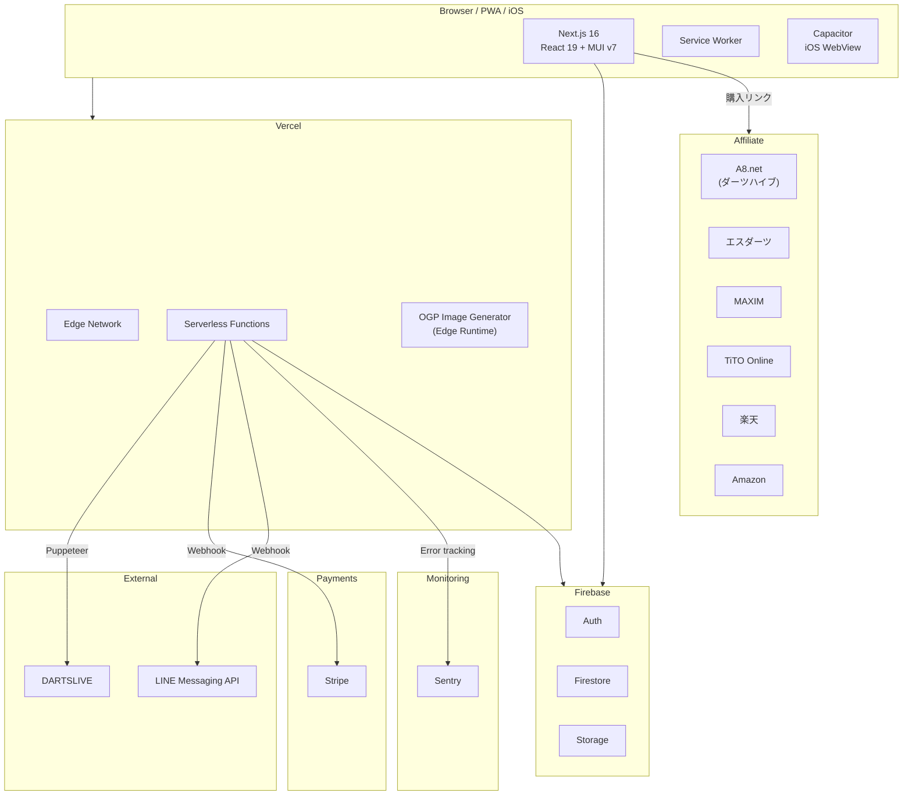

[](https://nextjs.org/)
[](https://www.typescriptlang.org/)
[](https://react.dev/)
[](https://firebase.google.com/)
[](https://mui.com/)
[](https://stripe.com/)
[](https://vercel.com/)
[](https://capacitorjs.com/)
[](https://github.com/seiryuu1215/darts-app/actions/workflows/ci.yml)
[](./LICENSE)

# Darts Lab

> **Darts setup management, stats tracking, barrel discovery & community platform for darts players.**
>
> Register your dart setups (barrel, shaft, flight, tip), auto-fetch DARTSLIVE stats with graph visualization, find your ideal barrel with a simulator & quiz, discuss settings and practice tips with fellow players, and purchase seamlessly via affiliate links.

**Demo:** [https://darts-app-lime.vercel.app](https://darts-app-lime.vercel.app)

---

ダーツプレイヤー向けのセッティング管理・スタッツ記録・バレル探索・コミュニティ Web アプリケーション。

自身のダーツセッティング（バレル・シャフト・フライト・チップ）を登録・共有し、DARTSLIVE のスタッツを自動取得してグラフで成長を可視化。バレルシミュレーターや診断クイズでぴったりのバレルを見つけ、ディスカッション機能でセッティング相談や練習法を共有し、アフィリエイト連携で購入までシームレスに繋げます。

## Screenshots

|               ホーム               |                バレル検索                |               スタッツ               |
| :--------------------------------: | :--------------------------------------: | :----------------------------------: |
|  |  |  |

|           セッティング登録           |             バレルシミュレーター             |             診断クイズ             |
| :----------------------------------: | :------------------------------------------: | :--------------------------------: |
|  |  |  |

## 主な機能

### セッティング管理

- バレル・チップ・シャフト・フライトの組み合わせを登録
- 7,000種以上のバレルデータベースから検索・選択（サムネイル画像付き）
- 17種類のチッププリセット（L-style / TIGA / Target / CONDOR / COSMO）
- 主要メーカーのシャフト・フライト製品プリセットから選択、またはカスタム入力
- CONDOR AXE（一体型パーツ）対応
- パーツ互換性チェック（シャフト × フライトの組み合わせ検証）
- スペック（重量・全長）の自動計算
- 2つのセッティングを横並びで比較
- セッティング変更履歴の記録・追跡
- X（Twitter）での OGP 画像付きシェア

### バレルデータベース & 探索

- バレル製品をスペック（重量・径・長さ・カット）で横断検索
- 人気売上ランキング（週間/月間/総合タブ切替）
- **バレルシミュレーター**: 実寸スケールで画像を重ねて形状比較（最大2本）
- **診断クイズ**: 6つの質問に答えるだけでおすすめバレルを提案（MUI Stepper）
- ユーザーの傾向に基づくレコメンドエンジン（マルチファクタースコアリング）
- ブックマーク＆検索結果からセッティング下書き作成

### ディスカッション（掲示板）

- 6カテゴリの固定テーマ制（セッティング相談・レーティング・バレル選び・練習法・ギア・雑談）
- 投稿者のレーティング（Rt）・使用バレルを自動表示し、発言の説得力を可視化
- PRO+ ユーザーがスレッド作成、全ログインユーザーが返信可能
- ピン留め・ロック機能（admin）
- 最新ディスカッションをホーム・サイドバーに自動表示

### DARTSLIVE スタッツ連携（PRO）

- DARTSLIVE アカウントからスタッツを自動取得（Puppeteer によるサーバーサイドスクレイピング）
- **プレイヤープロフィールカード**（カード名・通り名・プロフィール画像・ホームショップ + Google Maps 連携）
- Rating / 01 / Cricket / COUNT-UP の月間推移グラフ（Recharts）
- **パーセンタイル表示**（上位X%チップ — DARTSLIVE公式分布2024推定に基づく）
- **ブル統計カード**（D-BULL / S-BULL 累計 + ドーナツチャート + 月間バーチャート）
- **COUNT-UP ±差分チャート**（直近30回のスコア変動を緑/赤で可視化）
- 直近プレイデータの可視化
- 前回との比較（±表示）
- レーティング目標分析（次のRt到達に必要なPPD/MPRを算出）
- カウントアップのRt期待値基準カラー表示
- 期間別スタッツ集計（今日/今週/今月/累計）
- **おすすめブランドPRセクション**（JOKER DRIVER / JD ULTIMATE / POINT ARM）
- **モジュラーアーキテクチャ**: 14コンポーネントに分割（`components/stats/`）

### 手動スタッツ記録

- 練習の調子やメモを手動で記録・管理
- 全ユーザーが利用可能

### 記事（admin 限定）

- Markdown ベースの公式コンテンツ（バレルレビュー・初心者ガイド・攻略記事等）
- カバー画像・タグ・おすすめフラグ・固定ページ対応
- SEO 集客用の運営コンテンツとして機能

### アフィリエイト連携 & 収益化

- **6ショップ対応**: ダーツハイブ（A8.net）・エスダーツ・MAXIM・TiTO Online・楽天・Amazon
- 環境変数ベースのアフィリエイトID管理（未設定時は直リンクにフォールバック）
- 全バレルカード・詳細ページ・サイドバー・フッターにショップリンク

### ダークモード

- OS 設定自動検出 + 手動切替
- localStorage に設定を永続化
- インラインスクリプトによる FOUC（ちらつき）防止

### LINE 連携

- LINE アカウントとの連携・解除
- LINE 経由でのスタッツ通知

### XP / 経験値システム

- スタッツ記録・ディスカッション投稿・アワード獲得でXPを獲得
- 20段階のダーツテーマランク（Rookie → THE GOD）
- 12種類の実績（初スタッツ・100ゲーム・Rating 5.00 到達など）
- ダッシュボードにXPバー表示、スタッツページに実績一覧・XP履歴

### 目標設定・進捗トラッキング

- 月間/年間の目標を設定（ブル数・ゲーム数・Rating・プレイ日数・HAT TRICK）
- DARTSLIVE スタッツから進捗をリアルタイム計算
- 目標達成時に自動 XP 付与
- 日割りペース・達成予測の表示

### PWA & iOS ネイティブアプリ

- Service Worker によるオフラインキャッシュ（Serwist）
- モバイルでホーム画面に追加して使用可能
- **Capacitor** によるiOSネイティブアプリ対応（WebView + Vercel リモートURL方式）
- Safe area対応（`viewport-fit: cover`）

## ロール別機能一覧

| 機能                                      | general（無料） | pro（有料） | admin  |
| ----------------------------------------- | :-------------: | :---------: | :----: |
| セッティング登録                          |     最大3件     |   無制限    | 無制限 |
| セッティング閲覧・いいね・コメント        |        o        |      o      |   o    |
| バレル検索・クイズ・シミュレーター        |        o        |      o      |   o    |
| セッティング比較・履歴                    |        o        |      o      |   o    |
| ディスカッション閲覧・返信                |        o        |      o      |   o    |
| ディスカッション作成                      |        x        |      o      |   o    |
| プロフィール編集                          |        o        |      o      |   o    |
| 手動スタッツ記録                          |        o        |      o      |   o    |
| DARTSLIVE連携（自動取得・グラフ・Rt目標） |        x        |      o      |   o    |
| 記事投稿・編集                            |        x        |      x      |   o    |
| ディスカッション管理（ピン留め・ロック）  |        x        |      x      |   o    |
| ユーザーロール管理                        |        x        |      x      |   o    |

## 技術スタック

| カテゴリ       | 技術                                                     |
| -------------- | -------------------------------------------------------- |
| フレームワーク | Next.js 16 (App Router)                                  |
| 言語           | TypeScript 5 (strict)                                    |
| UI             | React 19, MUI v7                                         |
| 認証           | NextAuth.js 4 + Firebase Authentication                  |
| データベース   | Cloud Firestore                                          |
| ストレージ     | Firebase Storage                                         |
| 決済           | Stripe (Subscription / Webhook)                          |
| グラフ         | Recharts 3                                               |
| スクレイピング | Puppeteer 24                                             |
| エラー監視     | Sentry                                                   |
| テスト         | Vitest (110+ tests)                                      |
| フォーマッター | Prettier                                                 |
| CI             | GitHub Actions (lint / format / test / build)            |
| PWA            | Serwist (Workbox ベース)                                 |
| モバイル       | Capacitor 8 (iOS WebView)                                |
| ホスティング   | Vercel                                                   |
| IaC            | Firebase CLI (firestore.rules / storage.rules / indexes) |

## アーキテクチャ



- **サーバーレスアーキテクチャ**: Vercel + Firebase による完全マネージド構成
- **JWT 認証**: NextAuth.js によるセッション管理、ロールベースアクセス制御（admin/pro/general）
- **APIミドルウェア**: `lib/api-middleware.ts` による認証・権限・エラーハンドリングの共通化
- **権限管理**: `lib/permissions.ts` による一元的なロール判定（セッティング上限・DARTSLIVE連携・記事投稿・ディスカッション）
- **独自レコメンドエンジン**: 重量(30点)・径(25点)・長さ(25点)・カット(15点)・ブランド(5点)の100点スコアリング
- **バレルシミュレーター**: 実寸スケール（mm→px変換）でバレル画像を重ね合わせ比較
- **レーティング分析**: DARTSLIVE Rt計算式に基づく目標PPD/MPR算出・均等目標提案
- **OGP画像生成**: `next/og` (Edge Runtime) によるセッティング共有用の動的OGP画像
- **Stripe課金**: Checkout Session → Webhook → Firestore ロール更新のサーバーサイド完結フロー
- **アフィリエイト基盤**: `lib/affiliate.ts` による環境変数ベースのURL変換（6ショップ対応）
- **ダークモード**: インラインスクリプトによるFOUC防止 + localStorage永続化 + OS設定連動
- **Firebase ルール管理**: `firestore.rules` / `storage.rules` / `firestore.indexes.json` によるコード管理（Firebase CLI デプロイ）
- **レートリミッター**: `lib/api-middleware.ts` による IP ベースのリクエスト制限（60 req/min）
- **XPシステム**: スタッツ記録・アワード・ストリークでXP付与、20段階ランク、12実績
- **PWA + ネイティブ**: Serwist による Workbox ベースのキャッシュ戦略 + Capacitor iOS 対応（WebView リモートURL方式）

## セットアップ

### 前提条件

- Node.js 18+
- npm
- Firebase プロジェクト（Auth, Firestore, Storage を有効化）

### インストール

```bash
git clone https://github.com/seiryuu1215/darts-app.git
cd darts-app
npm install
```

### 環境変数

`.env.example` を `.env.local` にコピーし、各値を設定してください。

```bash
cp .env.example .env.local
```

| 変数                                 | 説明                                                      |
| ------------------------------------ | --------------------------------------------------------- |
| `NEXT_PUBLIC_FIREBASE_*`             | Firebase クライアントSDK設定                              |
| `NEXTAUTH_SECRET`                    | NextAuth JWT 署名キー（`openssl rand -base64 32` で生成） |
| `NEXTAUTH_URL`                       | アプリの URL（開発: `http://localhost:3000`）             |
| `ADMIN_EMAIL`                        | 管理者メールアドレス                                      |
| `STRIPE_SECRET_KEY`                  | Stripe シークレットキー                                   |
| `STRIPE_WEBHOOK_SECRET`              | Stripe Webhook 署名シークレット                           |
| `NEXT_PUBLIC_STRIPE_PUBLISHABLE_KEY` | Stripe 公開キー                                           |
| `NEXT_PUBLIC_RAKUTEN_AFFILIATE_ID`   | 楽天アフィリエイトID（任意）                              |
| `NEXT_PUBLIC_AMAZON_ASSOCIATE_TAG`   | AmazonアソシエイトTag（任意）                             |
| `NEXT_PUBLIC_A8_MEDIA_ID`            | A8.net メディアID（任意）                                 |
| `LINE_CHANNEL_SECRET`                | LINE Messaging API チャネルシークレット（任意）           |
| `LINE_CHANNEL_ACCESS_TOKEN`          | LINE チャネルアクセストークン（任意）                     |
| `SENTRY_DSN`                         | Sentry エラー監視用 DSN（任意）                           |
| `FIREBASE_SERVICE_ACCOUNT_KEY`       | Firebase Admin SDK サービスアカウント JSON（Vercel用）    |

### Firebase ルールのデプロイ

```bash
npx firebase-tools deploy --only firestore   # Firestore ルール
npx firebase-tools deploy --only storage     # Storage ルール
```

### 開発サーバー

```bash
npm run dev
```

`http://localhost:3000` でアプリが起動します。

### テスト

```bash
npm run test        # 全テスト実行
npm run test:watch  # ウォッチモード
```

### ビルド

```bash
npm run build  # Webpack モードで Service Worker も生成
```

### iOS ネイティブアプリ（Capacitor）

```bash
npx cap sync ios     # Web → iOS プロジェクト同期
npx cap open ios     # Xcode で開く
```

本番は `capacitor.config.ts` の `server.url` に Vercel URL を指定（リモートURL方式）。
開発時はローカル dev server のIPに切り替え:

```typescript
// capacitor.config.ts
server: {
  url: 'http://<PCのIP>:3000',
  cleartext: true,
}
```

## ディレクトリ構成

```
darts-app/
├── app/                        # Next.js App Router
│   ├── api/                    #   API エンドポイント
│   │   ├── og/                 #     OGP画像生成 (Edge Runtime)
│   │   ├── stripe/             #     Stripe Checkout / Webhook
│   │   ├── line/               #     LINE連携 (Webhook / Link / Unlink)
│   │   ├── dartslive-stats/    #     DARTSLIVE スクレイピング (Puppeteer)
│   │   ├── progression/        #     XP取得・付与API
│   │   ├── goals/              #     目標CRUD・進捗計算API
│   │   ├── cron/               #     定時バッチ（日次スタッツ取得）
│   │   └── ...                 #     認証・スタッツ・管理
│   ├── darts/                  #   セッティング管理
│   ├── barrels/                #   バレル検索
│   │   ├── recommend/          #     おすすめ検索
│   │   ├── simulator/          #     シミュレーター
│   │   └── quiz/               #     診断クイズ
│   ├── discussions/            #   ディスカッション（掲示板）
│   ├── stats/                  #   スタッツ記録
│   ├── articles/               #   記事（admin限定）
│   ├── bookmarks/              #   ブックマーク
│   ├── admin/                  #   管理機能
│   ├── about/                  #   サイトについて
│   ├── privacy/                #   プライバシーポリシー
│   ├── terms/                  #   利用規約
│   ├── sw.ts                   #   Service Worker エントリ
│   └── layout.tsx              #   ルートレイアウト (PWA / ダークモード初期化)
├── components/                 # 再利用 UI コンポーネント
│   ├── layout/                 #   Header, Footer, TwoColumn, Sidebar, Breadcrumbs
│   ├── affiliate/              #   AffiliateButton
│   ├── darts/                  #   DartCard, DartDetail, DartForm
│   ├── barrels/                #   BarrelCard, BarrelSimulator, BarrelQuiz
│   ├── stats/                  #   スタッツダッシュボード（14コンポーネント）
│   │   ├── PlayerProfileCard   #     プロフィール（Google Maps連携）
│   │   ├── RatingHeroCard      #     レーティング + パーセンタイル
│   │   ├── GameStatsCards      #     01/Cricket/CU + パーセンタイル
│   │   ├── BullStatsCard       #     ブル統計 + チャート
│   │   ├── CountUpDeltaChart   #     COUNT-UP ±差分
│   │   ├── PercentileChip      #     上位X%バッジ
│   │   └── ...                 #     他8コンポーネント
│   ├── progression/            #   XpBar, AchievementList, XpHistoryList, LevelUpSnackbar
│   ├── goals/                  #   GoalSection, GoalCard, GoalSettingDialog
│   ├── discussions/            #   DiscussionCard, ReplyForm, ReplyList, CategoryTabs
│   ├── articles/               #   ArticleCard, MarkdownContent
│   └── comment/                #   CommentForm, CommentList
├── lib/                        # ビジネスロジック・ユーティリティ
│   ├── api-middleware.ts       #   API認証・権限・エラーハンドリング共通化
│   ├── permissions.ts          #   ロール別権限判定ユーティリティ
│   ├── affiliate.ts            #   アフィリエイトURL変換（6ショップ対応）
│   ├── darts-parts.ts          #   チップ・シャフト・フライトのマスターデータ
│   ├── recommend-barrels.ts    #   レコメンドエンジン + クイズスコアリング
│   ├── calc-totals.ts          #   スペック合計計算
│   ├── dartslive-rating.ts     #   DARTSLIVE Rt計算（PPD/MPR⇔Rt変換）
│   ├── dartslive-colors.ts     #   フライト・カテゴリカラー定義
│   ├── dartslive-percentile.ts #   パーセンタイル分布データ + 推定関数
│   ├── goals.ts                #   目標定義・進捗計算ヘルパー
│   ├── progression/            #   XPエンジン・ランク・実績定義
│   │   ├── xp-rules.ts        #     XPアクション定義（12種）
│   │   ├── ranks.ts            #     20段階ランク定義
│   │   ├── achievements.ts     #     12実績定義
│   │   └── xp-engine.ts        #     レベル計算・実績チェック
│   ├── line.ts                 #   LINE Messaging API ヘルパー
│   ├── firebase.ts             #   Firebase クライアント初期化
│   ├── firebase-admin.ts       #   Firebase Admin SDK
│   └── auth.ts                 #   NextAuth 設定
├── firestore.rules             # Firestore セキュリティルール（コード管理）
├── storage.rules               # Firebase Storage セキュリティルール（コード管理）
├── firestore.indexes.json      # Firestore 複合インデックス定義
├── firebase.json               # Firebase CLI 設定
├── types/                      # TypeScript 型定義
├── ios/                        # Capacitor iOS Xcode プロジェクト
├── capacitor.config.ts         # Capacitor 設定（本番: Vercel URL）
├── scripts/                    # スクレイピング・データ管理スクリプト
├── docs/                       # 設計ドキュメント
│   ├── ARCHITECTURE.md         #   アーキテクチャ設計書 (Mermaid図付き)
│   ├── 01-requirements.md      #   要件定義書
│   ├── 02-basic-design.md      #   基本設計書
│   ├── 03-detailed-design.md   #   詳細設計書
│   ├── 04-task-breakdown.md    #   タスク分解
│   └── 05-security-review.md   #   セキュリティレビュー
└── public/                     # 静的アセット
    ├── manifest.json           #   PWA マニフェスト
    └── icons/                  #   PWA アイコン
```

## 設計ドキュメント

| ドキュメント                                       | 内容                                                  |
| -------------------------------------------------- | ----------------------------------------------------- |
| [アーキテクチャ設計書](docs/ARCHITECTURE.md)       | システム構成図・ページ遷移図・データフロー（Mermaid） |
| [要件定義書](docs/01-requirements.md)              | 目的・ユーザー定義・機能一覧・非機能要件              |
| [基本設計書](docs/02-basic-design.md)              | システム構成・技術選定理由・DB設計                    |
| [詳細設計書](docs/03-detailed-design.md)           | 画面設計・API設計・認証フロー・状態管理               |
| [タスク分解](docs/04-task-breakdown.md)            | 開発チェックリスト                                    |
| [セキュリティレビュー](docs/05-security-review.md) | セキュリティ観点のレビュー結果                        |

## セキュリティ

- 認証情報はサーバーサイドのみで処理し、永続化しない（DARTSLIVE 認証情報含む）
- **Firestore セキュリティルール**: フィールドレベル制限（`role`・Stripe 関連・XP/レベル/ランクフィールドのユーザー自己変更を禁止）
- **Firebase Storage ルール**: 画像のみ（jpeg/png/gif/webp）、5MB 制限、パス別権限（`storage.rules`）
- **レートリミット**: IP ベースの in-memory レートリミッター（60 req/min）
- **タイミングセーフ署名検証**: LINE Webhook で `crypto.timingSafeEqual` を使用
- **SSRF 防止**: OG 画像生成でドメインホワイトリスト（`firebasestorage.googleapis.com` のみ）
- **SVG ブロック**: 画像プロキシで SVG を除外（XSS 防止）、HTTPS のみ許可
- **CSV インジェクション防止**: エクスポート時に数式プレフィックス文字をエスケープ
- **replyCount 不正操作防止**: Firestore ルールで +1 のみ許可
- 環境変数による秘密情報管理（`.env.local` は Git 管理外）
- ロールベースのAPI保護（`lib/permissions.ts` による一元管理）
- Stripe Webhook 署名検証 + イベント重複排除
- セキュリティヘッダー（HSTS, X-Frame-Options, CSP 相当）
- Sentry によるエラー監視・例外追跡

## ライセンス

[MIT](./LICENSE)
