

# Darts Lab

> **Darts setup management, stats tracking, barrel discovery & community platform for darts players.**

ダーツプレイヤー向けのセッティング管理・スタッツ記録・バレル探索・コミュニティ Web アプリケーション。自身のダーツセッティングを登録・共有し、DARTSLIVE のスタッツを自動取得してグラフで成長を可視化。バレルシミュレーターや診断クイズでぴったりのバレルを見つけ、ディスカッション機能でセッティング相談や練習法を共有できます。

**Demo:** [https://darts-app-lime.vercel.app](https://darts-app-lime.vercel.app)

---

## プロジェクト規模

| コード行数  | コンポーネント | ページ | API Routes | テスト  |         Storybook          | コミット | 設計書 |
| :---------: | :------------: | :----: | :--------: | :-----: | :------------------------: | :------: | :----: |
| **82,000+** |    **142**     | **40** |   **41**   | **632** | **62 files / 235 stories** | **310**  | **12** |

---

## デモアカウント

以下のデモアカウントでログインして機能を試せます（データは毎日リセットされます）。

| ロール  | メールアドレス                   | パスワード | 主な機能                          |
| ------- | -------------------------------- | ---------- | --------------------------------- |
| General | `demo-general@darts-lab.example` | `demo1234` | バレル検索、セッティング登録      |
| Pro     | `demo-pro@darts-lab.example`     | `demo1234` | DARTSLIVEスタッツ連携、グラフ表示 |
| Admin   | `demo-admin@darts-lab.example`   | `demo1234` | 記事投稿、ディスカッション管理    |

### デモアカウントの制限

デモアカウントは閲覧中心の体験用です。データの永続的な変更を防ぐため、以下の操作が制限されています。

<b>クライアント側の制限（useDemoGuard）</b>

制限された操作を実行すると「デモアカウントではこの操作はできません」というトーストが表示されます。

| 機能                   | 制限内容                 |
| ---------------------- | ------------------------ |
| セッティング登録・編集 | 保存ボタンが無効化       |
| スタッツ手動記録       | 送信ボタンが無効化       |
| プロフィール編集       | 保存ボタンが無効化       |
| 記事投稿・編集         | 公開・保存ボタンが無効化 |
| ディスカッション作成   | 投稿ボタンが無効化       |
| コメント・返信         | 送信ボタンが無効化       |
| FocusPoints追加        | 追加ボタンが非表示       |
| バレルブックマーク     | ブックマーク操作が無効化 |
| LINE連携               | 連携ボタンが無効化       |

<b>API側の制限（全デモ共通）</b>

| ブロック対象API                                                                    | 理由                     |
| ---------------------------------------------------------------------------------- | ------------------------ |
| `/api/account/delete`                                                              | アカウント削除防止       |
| `/api/stripe/checkout`, `/api/stripe/portal`                                       | 決済・課金操作防止       |
| `/api/line/link`, `/api/line/save-dl-credentials`, `/api/line/save-px-credentials` | 外部サービス連携防止     |
| `/api/upload`                                                                      | ファイルアップロード防止 |
| `/api/health/sync`                                                                 | HealthKitデータ同期防止  |

<b>API側の制限（Admin デモ追加分）</b>

| ブロック対象API                                                        | 理由                    |
| ---------------------------------------------------------------------- | ----------------------- |
| `/api/admin/update-role`, `/api/admin/delete-user`, `/api/admin/users` | ユーザー管理操作防止    |
| `/api/admin/update-pricing`                                            | 料金設定変更防止        |
| `/api/admin/dartslive-sync`, `/api/admin/dartslive-history`            | DARTSLIVE同期操作防止   |
| `/api/admin/phoenix-sync`, `/api/admin/phoenix-stats`                  | PHOENIX同期操作防止     |
| `/api/admin/line-test`                                                 | LINE Bot テスト送信防止 |
| `/api/admin/articles`, `/api/admin/barrel-scrape`                      | コンテンツ管理操作防止  |

### モックデータ

デモアカウントには以下のモックデータが自動生成されます（`lib/demo-seed-data.ts`）。

| データ種別           | 内容                                    | 対象ロール |
| -------------------- | --------------------------------------- | ---------- |
| ユーザープロフィール | レベル・XP・ランク・実績                | 全ロール   |
| DARTSLIVEスタッツ    | 30日分のRating・01・Cricket・CU推移     | Pro, Admin |
| セッティング         | ソフト2本+スティール1本の登録済みダーツ | 全ロール   |
| 目標                 | Rating目標・HAT TRICK月間目標           | 全ロール   |
| XP履歴               | 10件のXP獲得履歴                        | Pro, Admin |
| FocusPoints          | 3つの練習意識ポイント                   | 全ロール   |
| バレルブックマーク   | 5件のお気に入りバレル                   | Pro, Admin |
| ショップブックマーク | 2件のショップ（Bee渋谷・TiTO新宿）      | Pro, Admin |
| ディスカッション     | 2件の投稿+3件の返信                     | Pro, Admin |

### 日次リセット

Vercel Cron（`/api/cron/reset-demo`）が毎日自動実行され、デモデータを初期状態にリセットします。

1. 全サブコレクション削除（スタッツ・通知・ブックマーク・XP履歴など14種）
2. ユーザー作成コンテンツ削除（セッティング・ディスカッション＋コメント・返信）
3. ユーザードキュメントを初期データで再作成
4. モックデータの再投入

### 関連ファイル

| ファイル                           | 内容                                   |
| ---------------------------------- | -------------------------------------- |
| `lib/demo.ts`                      | デモアカウント定義・ブロックルート一覧 |
| `lib/demo-seed-data.ts`            | モックデータ生成関数                   |
| `hooks/useDemoGuard.ts`            | クライアント側制限フック               |
| `lib/api-middleware.ts`            | API側制限ロジック                      |
| `app/api/cron/reset-demo/route.ts` | 日次リセットCronハンドラ               |
| `scripts/seed-demo-accounts.ts`    | 初期セットアップスクリプト             |

---

## Screenshots

|               ホーム               |                バレル検索                |               スタッツ               |
| :--------------------------------: | :--------------------------------------: | :----------------------------------: |
| 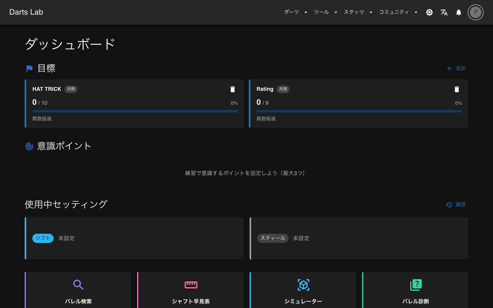 | 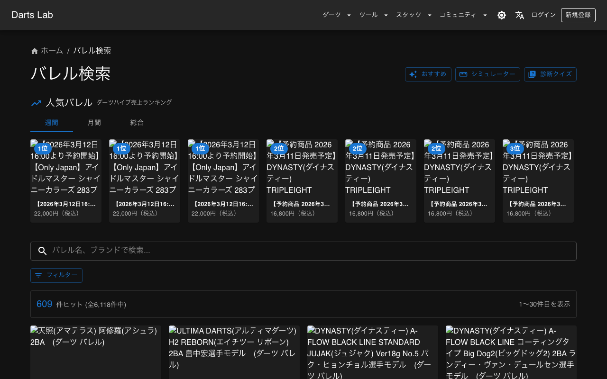 | 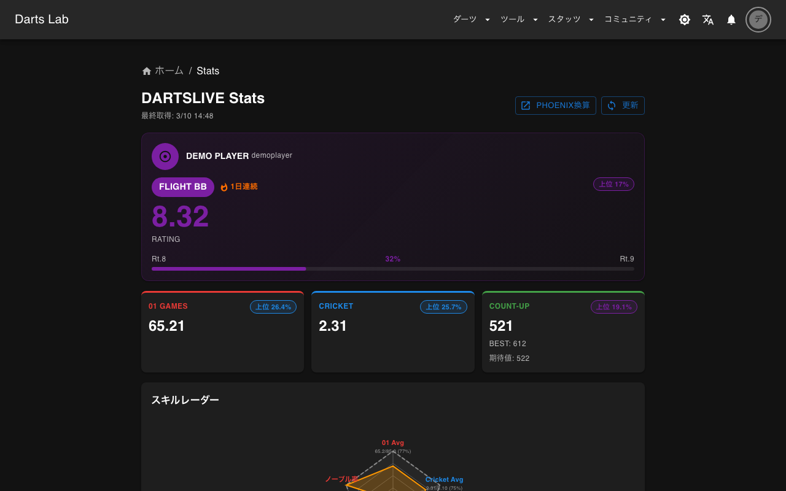 |

|           セッティング登録           |             バレルシミュレーター             |             診断クイズ             |
| :----------------------------------: | :------------------------------------------: | :--------------------------------: |
| 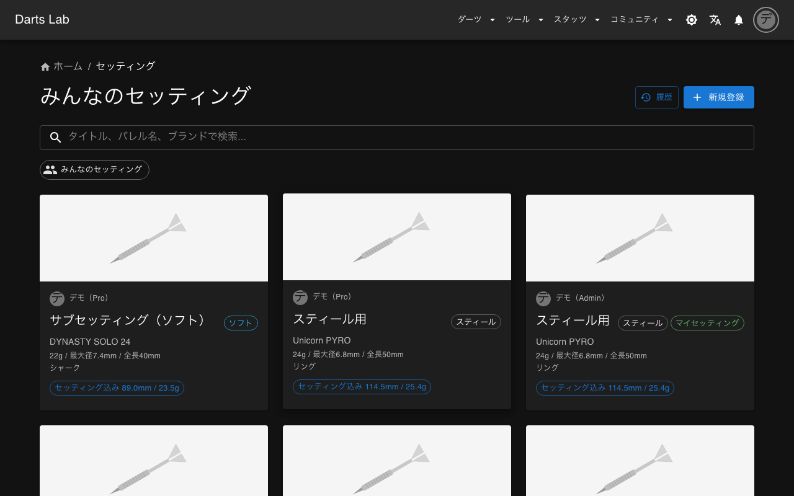 | 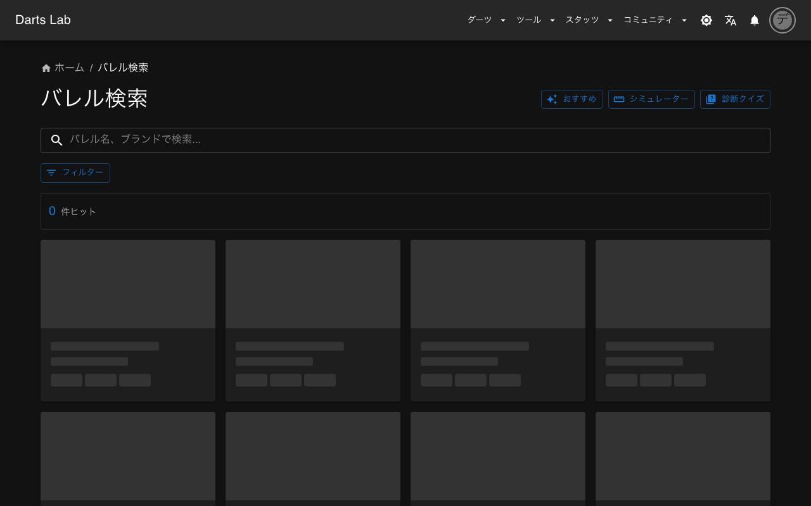 | 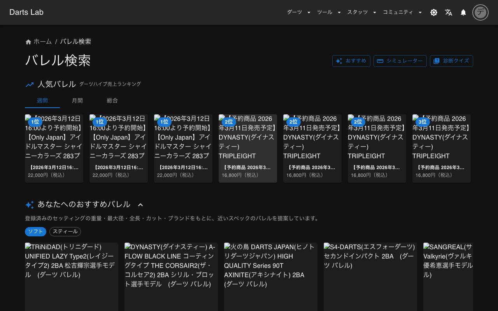 |

|             マイショップ             |                 ディスカッション                 |
| :----------------------------------: | :----------------------------------------------: |
| 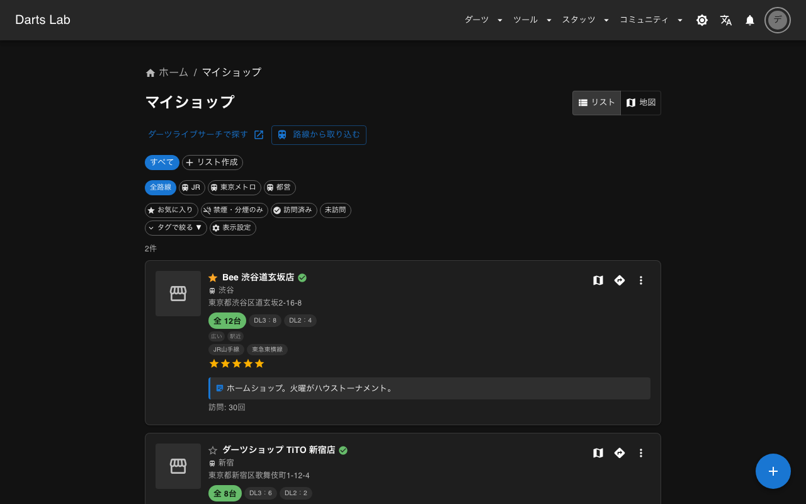 | 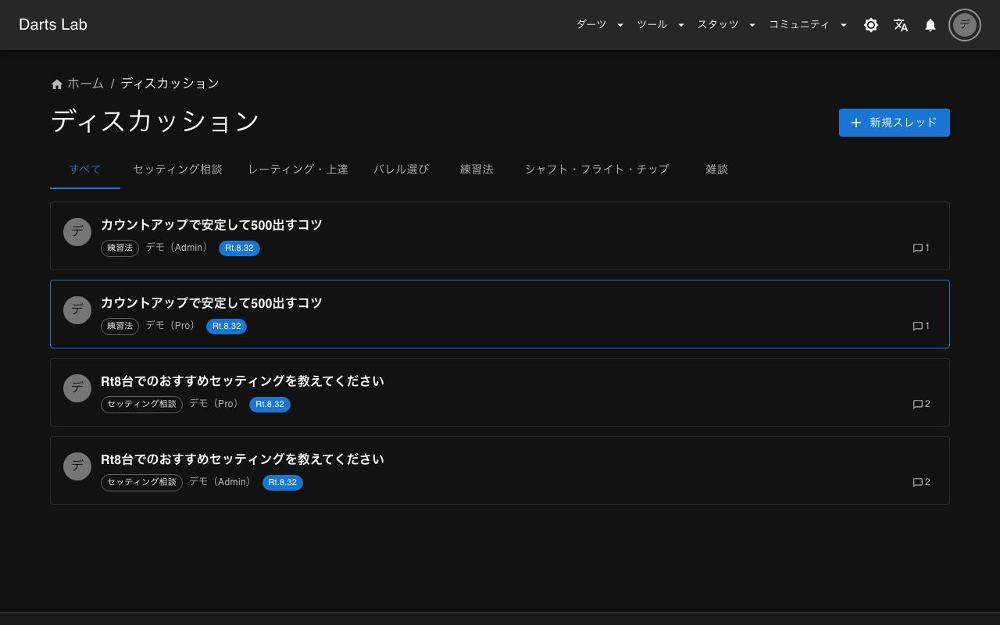 |

|                 カレンダー                 |             セッティング比較             |                おすすめバレル                |
| :----------------------------------------: | :--------------------------------------: | :------------------------------------------: |
| 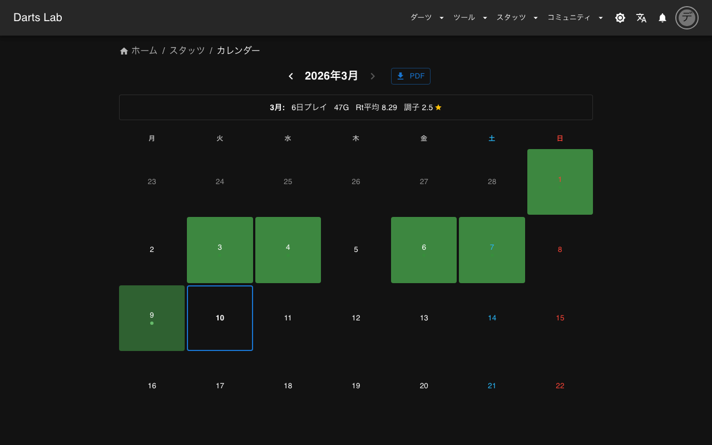 | 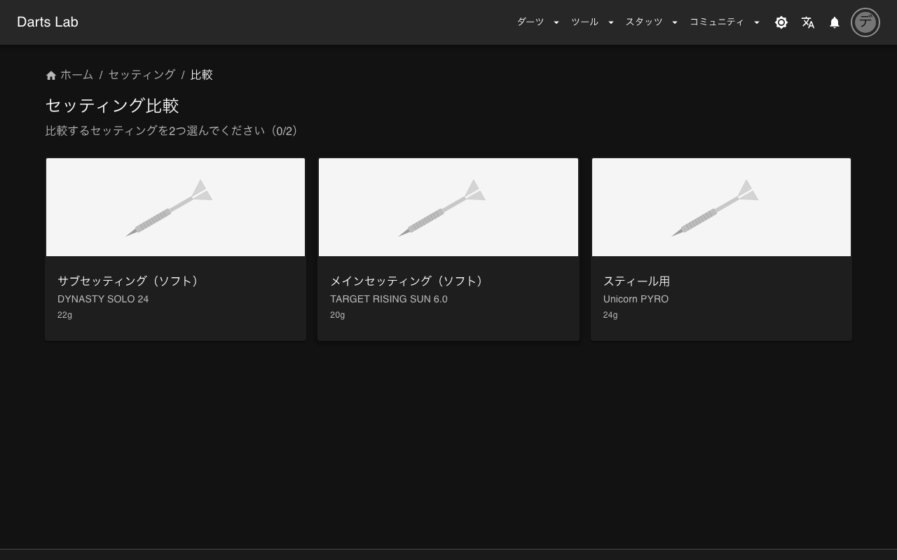 |  |

---

## 設計・技術のポイント

- **フルサーバーレス構成** — Vercel Serverless Functions + Firebase + Upstash Redis。インフラ管理ゼロで運用継続中
- **3段階 SaaS モデル** — general / pro / admin のロールベースアクセス制御。Stripe Checkout → Webhook → Firestore ロール更新のサーバーサイド完結フロー
- **DARTSLIVE スタッツ自動取得** — Puppeteer スクレイピング + 公式 API のデュアルパス同期。Vercel Cron で日次バッチ処理（XP付与 → 実績チェック → 週次/月次レポート配信）
- **統計分析エンジン** — ピアソン相関・線形回帰・スピード分析・ブル率シミュレーター・パーセンタイル算出を自前実装。フライト別ベンチマーク付きスキルレーダー
- **独自レコメンドエンジン** — 重量(30)・径(25)・長さ(25)・カット(15)・ブランド(5) の 100点スコアリングで 7,000+ バレルからレコメンド
- **iOS HealthKit 連携** — Swift Capacitor Plugin で心拍・HRV・睡眠・歩数を取得し、ダーツパフォーマンスとの相関分析・インサイト自動生成
- **LINE Bot 連携** — Flex Message でスタッツカルーセル・週次/月次レポート・疲労アラートを自動配信。Rich Menu + Quick Reply で双方向操作
- **AI 駆動開発** — Claude Code で設計〜実装〜テストを一貫して開発

---

## 主な機能

### セッティング管理

バレル・チップ・シャフト・フライトの組み合わせを登録、スペック自動計算、比較、変更履歴、OGP付きシェア

### バレル検索 & 探索

7,000種以上のDB、スペック横断検索、売上ランキング、実寸シミュレーター、診断クイズ、レコメンドエンジン

### DARTSLIVE スタッツ連携 (PRO)

自動取得（Puppeteer + API）、Rating/01/Cricket/COUNT-UP の月間推移グラフ、パーセンタイル表示、ブル統計、Rt目標分析、スキルレーダー（フライト別ベンチマーク付き）、レーティングトレンドスパークライン、セッション比較、ゲーム安定度分析、PHOENIX 換算、CU セッション間比較、カレンダーヒートマップ、CU分析（ミス方向・グルーピング）

### マイショップ

DARTSLIVE サーチ URL 貼り付けで店名・住所・駅・画像を自動登録、タグフィルター（禁煙・投げ放題等）、リスト管理、お気に入り、路線フィルター

### LINE レポート配信

LINE Flex Message で週次/月次レポートを自動配信（前期間比較付き）、リッチメニュー、練習メモ

### XP / 経験値

21種のXPルール、日次Cron自動付与、50段階ランク、12種の実績

### 目標トラッキング

月間/年間/デイリー目標の設定、DARTSLIVE スタッツからリアルタイム進捗計算、達成時にXP付与+紙吹雪演出、ヘルスケア目標（睡眠・HRV）対応

### ヘルスケア連携 (iOS)

HealthKit から心拍・HRV・睡眠・歩数等を取得、カウントアップ平均スコアとの相関分析・インサイト自動生成、コンディションスコア算出、疲労アラート

### ディスカッション & 記事

6カテゴリの掲示板（投稿者のRt・バレル自動表示）、Markdown ベースの公式コンテンツ

### その他

- **練習の意識ポイント** — トップ画面に最大3つの練習ポイントを設定
- **アフィリエイト連携** — ダーツハイブ（A8.net）・楽天・Amazon — 商品直リンク+検索で購入導線を提供
- **PWA & iOS** — Service Worker オフラインキャッシュ + Capacitor iOS ネイティブ
- **ダークモード** — OS連動 + 手動切替、FOUC防止

<b>ロール別機能一覧</b>

| 機能                                      | general（無料） | pro（有料） | admin  |
| ----------------------------------------- | :-------------: | :---------: | :----: |
| セッティング登録                          |     最大3件     |   無制限    | 無制限 |
| セッティング閲覧・いいね・コメント        |        o        |      o      |   o    |
| バレル検索・クイズ・シミュレーター        |        o        |      o      |   o    |
| セッティング比較・履歴                    |        o        |      o      |   o    |
| ディスカッション閲覧・返信                |        o        |      o      |   o    |
| ディスカッション作成                      |        x        |      o      |   o    |
| プロフィール編集                          |        o        |      o      |   o    |
| 手動スタッツ記録                          |        o        |      o      |   o    |
| DARTSLIVE連携（自動取得・グラフ・Rt目標） |        x        |      o      |   o    |
| 記事投稿・編集                            |        x        |      x      |   o    |
| ディスカッション管理（ピン留め・ロック）  |        x        |      x      |   o    |
| ユーザーロール管理                        |        x        |      x      |   o    |

---

## 技術スタック

| カテゴリ       | 技術                                                         |
| -------------- | ------------------------------------------------------------ |
| フレームワーク | Next.js 16 (App Router)                                      |
| 言語           | TypeScript 5 (strict)                                        |
| UI             | React 19, MUI v7                                             |
| 認証           | NextAuth.js 4 + Firebase Authentication                      |
| データベース   | Cloud Firestore                                              |
| ストレージ     | Firebase Storage                                             |
| 決済           | Stripe (Subscription / Webhook)                              |
| グラフ         | Recharts 3                                                   |
| スクレイピング | Puppeteer 24                                                 |
| メッセージング | LINE Messaging API (Webhook + Rich Menu)                     |
| エラー監視     | Sentry                                                       |
| レートリミット | Upstash Redis                                                |
| テスト         | Vitest (632 unit) + Storybook (235 stories) + Playwright E2E |
| CI             | GitHub Actions (lint / format / test / build)                |
| PWA            | Serwist (Workbox ベース)                                     |
| モバイル       | Capacitor 8 (iOS WebView)                                    |
| ヘルスケア     | HealthKit (Swift Capacitor Plugin)                           |
| ホスティング   | Vercel                                                       |

---

## セキュリティ

セキュリティレビュー実施済み — 詳細は [セキュリティレビュー](docs/05-security-review.md)

- Firestore / Storage セキュリティルールによるフィールドレベル制限
- レートリミット（Upstash Redis / IP ベース 60 req/min）
- タイミングセーフ署名検証（LINE Webhook HMAC）
- Stripe Webhook 署名検証 + イベント重複排除
- SSRF 防止（OG 画像生成でドメインホワイトリスト）
- SVG ブロック（画像プロキシ）、HTTPS のみ
- CSV インジェクション防止
- AES-256-GCM 暗号化（DARTSLIVE 認証情報）
- Sentry によるエラー監視・アラート

---

## アーキテクチャ

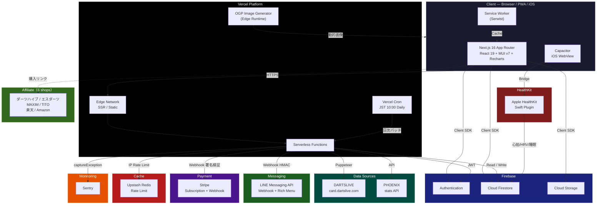
```mermaid
graph TB
    subgraph Client["Client — Browser / PWA / iOS"]
        App["Next.js 16 App Router<br/>React 19 + MUI v7 + Recharts"]
        SW["Service Worker<br/>(Serwist)"]
        Cap["Capacitor<br/>iOS WebView"]
    end

    subgraph Vercel["Vercel Platform"]
        Edge["Edge Network<br/>SSR / Static"]
        SF["Serverless Functions"]
        Cron["Vercel Cron<br/>JST 10:00 Daily"]
        OG["OGP Image Generator<br/>(Edge Runtime)"]
    end

    subgraph Firebase["Firebase"]
        Auth["Authentication"]
        FS["Cloud Firestore"]
        ST["Cloud Storage"]
    end

    subgraph ExtData["Data Sources"]
        DL["DARTSLIVE<br/>card.dartslive.com"]
        PX["PHOENIX<br/>stats API"]
    end

    subgraph Health["HealthKit"]
        HK["Apple HealthKit<br/>Swift Plugin"]
    end

    subgraph Messaging["Messaging"]
        LINE["LINE Messaging API<br/>Webhook + Rich Menu"]
    end

    subgraph Payment["Payment"]
        Stripe["Stripe<br/>Subscription + Webhook"]
    end

    subgraph Cache["Cache"]
        Redis["Upstash Redis<br/>Rate Limit"]
    end

    subgraph Monitor["Monitoring"]
        Sentry["Sentry"]
    end

    subgraph Affiliate["Affiliate（6 shops）"]
        Shops["ダーツハイブ / エスダーツ<br/>MAXIM / TiTO<br/>楽天 / Amazon"]
    end

    Client -->|HTTPS| Edge
    Edge --> SF
    App -->|Client SDK| FS
    App -->|Client SDK| Auth
    App -->|Client SDK| ST
    App -.->|購入リンク| Shops
    SW -.->|Cache| App

    Cron -->|日次バッチ| SF
    SF -->|Puppeteer| DL
    SF -->|API| PX
    SF -->|JWT| Auth
    SF -->|Read / Write| FS
    SF -->|Webhook 署名検証| Stripe
    SF -->|Webhook HMAC| LINE
    SF -->|IP Rate Limit| Redis
    SF -->|captureException| Sentry
    OG -->|動的画像| Client
    Cap -->|Bridge| HK
    HK -->|心拍/HRV/睡眠| FS

    style Client fill:#1a1a2e,stroke:#16213e,color:#e0e0e0
    style Vercel fill:#000,stroke:#333,color:#fff
    style Firebase fill:#1a237e,stroke:#283593,color:#fff
    style ExtData fill:#004d40,stroke:#00695c,color:#fff
    style Messaging fill:#1b5e20,stroke:#2e7d32,color:#fff
    style Payment fill:#4a148c,stroke:#6a1b9a,color:#fff
    style Cache fill:#b71c1c,stroke:#c62828,color:#fff
    style Monitor fill:#e65100,stroke:#ef6c00,color:#fff
    style Affiliate fill:#33691e,stroke:#558b2f,color:#fff
    style Health fill:#7f1d1d,stroke:#991b1b,color:#fff
```

- **サーバーレスアーキテクチャ**: Vercel + Firebase + Upstash Redis（レートリミット）による完全マネージド構成
- **JWT 認証**: NextAuth.js によるセッション管理、ロールベースアクセス制御（admin/pro/general）
- **日次 Cron バッチ**: Vercel Cron (JST 10:00) でスタッツ自動取得（DARTSLIVE Puppeteer / PHOENIX API 換算）→ XP付与 → 実績チェック → レポート配信 — 詳細は [docs/CRON.md](docs/CRON.md)
- **独自レコメンドエンジン**: 重量(30)・径(25)・長さ(25)・カット(15)・ブランド(5)の100点スコアリング
- **Stripe課金**: Checkout → Webhook → Firestore ロール更新のサーバーサイド完結フロー
- **PWA + ネイティブ**: Serwist によるキャッシュ戦略 + Capacitor iOS 対応

詳細は [ARCHITECTURE.md](docs/ARCHITECTURE.md) を参照。

---

## ドキュメント

| ドキュメント                                       | 内容                                                  |
| -------------------------------------------------- | ----------------------------------------------------- |
| [アーキテクチャ設計書](docs/ARCHITECTURE.md)       | システム構成図・ページ遷移図・データフロー（Mermaid） |
| [要件定義書](docs/01-requirements.md)              | 目的・ユーザー定義・機能一覧・非機能要件              |
| [基本設計書](docs/02-basic-design.md)              | システム構成・技術選定理由・DB設計                    |
| [詳細設計書](docs/03-detailed-design.md)           | 画面設計・API設計・認証フロー・状態管理               |
| [自動処理 (Cron)](docs/CRON.md)                    | 日次バッチの処理内容・認証・データフロー              |
| [セキュリティレビュー](docs/05-security-review.md) | セキュリティ観点のレビュー結果                        |

---

## ライセンス

[MIT](./LICENSE)
