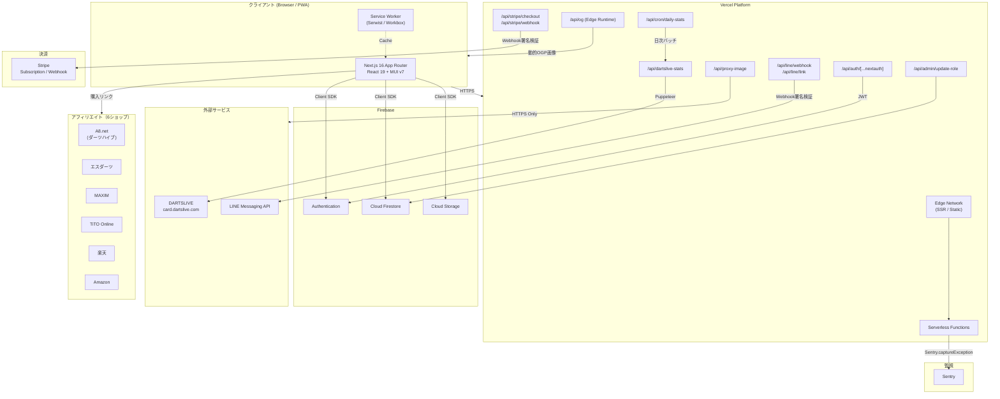
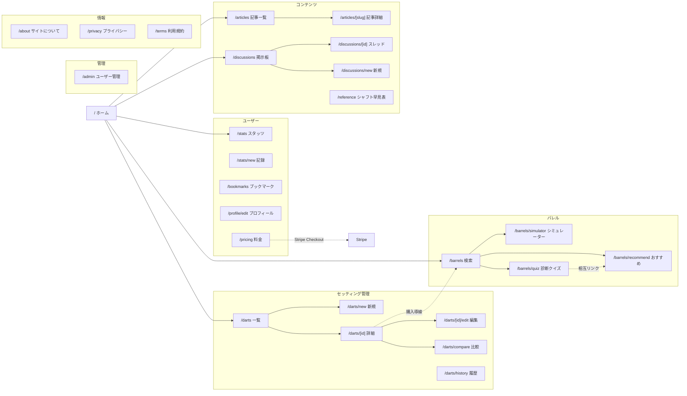
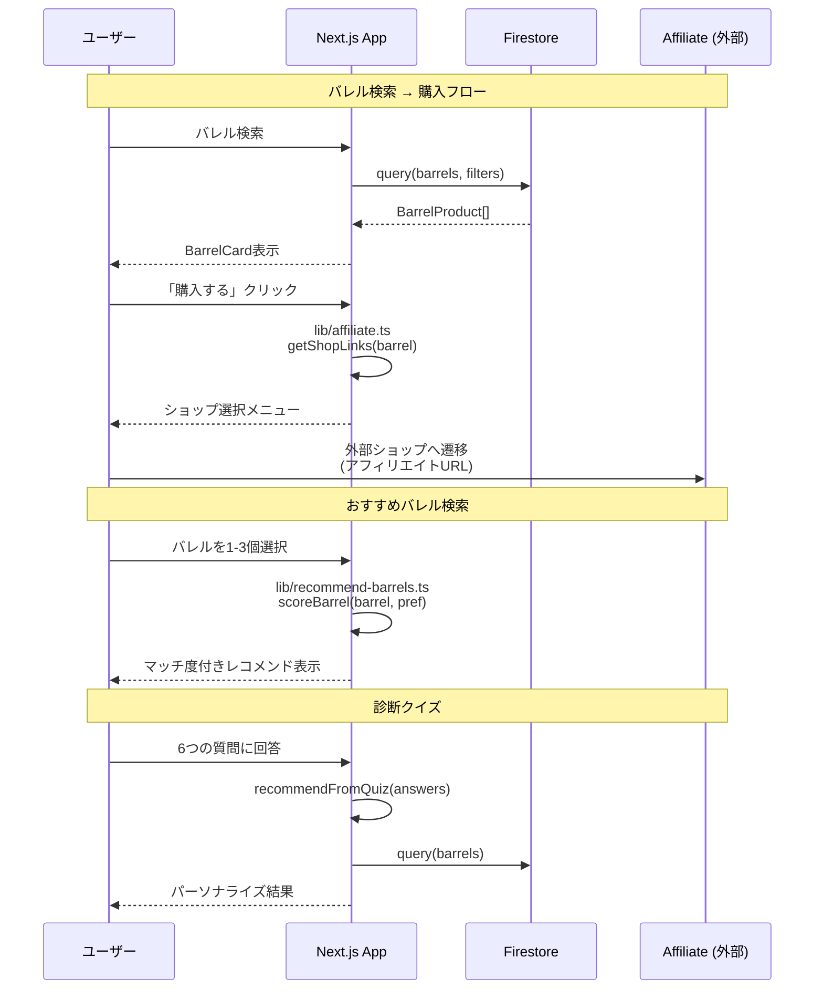
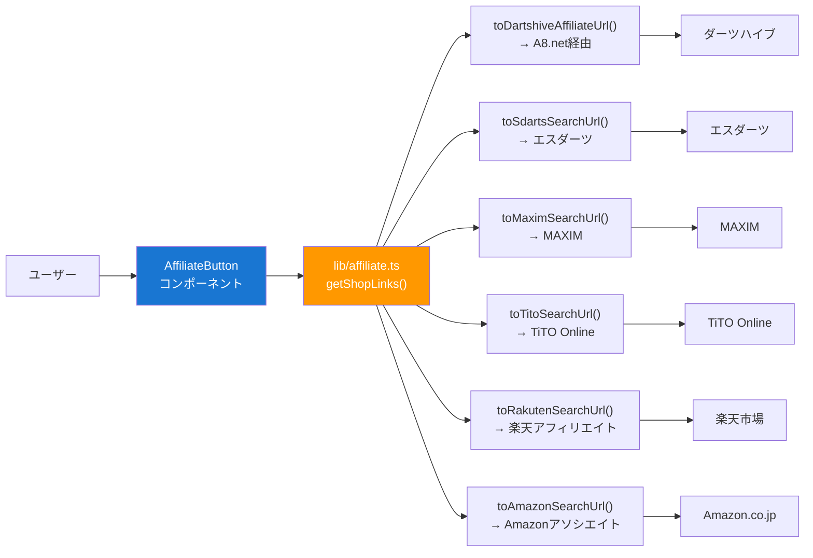

# Darts Lab - アーキテクチャ設計書

## 全体システム構成図



## ページ遷移図



## データフロー



## Firestore コレクション設計

```mermaid
erDiagram
    barrels {
        string name
        string brand
        number weight
        number maxDiameter
        number length
        string cut
        string imageUrl
        string productUrl
        string source
        timestamp scrapedAt
    }

    barrelRanking {
        number rank
        string name
        string imageUrl
        string productUrl
        string price
        timestamp updatedAt
    }

    darts {
        string userId
        string title
        object barrel
        object tip
        object shaft
        object flight
        array imageUrls
        string description
        number likeCount
        boolean isDraft
        timestamp createdAt
    }

    users {
        string displayName
        string email
        string role
        string activeSoftDartId
        string activeSteelDartId
        string stripeCustomerId
        string subscriptionStatus
        timestamp createdAt
    }

    articles {
        string slug
        string title
        string content
        array tags
        boolean isDraft
        boolean isFeatured
        string userId
        timestamp createdAt
    }

    discussions {
        string title
        string content
        string category
        string userId
        string userName
        number userRating
        string userBarrelName
        boolean isPinned
        boolean isLocked
        number replyCount
        timestamp lastRepliedAt
        timestamp createdAt
    }

    stripeEvents {
        string type
        boolean processed
        timestamp createdAt
    }

    lineConversations {
        string lineUserId
        string linkedFirebaseUid
        string state
    }

    lineLinkCodes {
        string firebaseUid
        timestamp expiresAt
    }

    config {
        object pricingPlans
    }

    darts ||--o{ comments : has
    darts ||--o{ memos : has
    discussions ||--o{ replies : has
    users ||--o{ likes : has
    users ||--o{ bookmarks : has
    users ||--o{ barrelBookmarks : has
    users ||--o{ settingHistory : has
    users ||--o{ dartsliveCache : "Admin SDK only"
    users ||--o{ dartsLiveStats : has
```



## コンポーネント構成

```
components/
├── layout/                    # レイアウト
│   ├── Header.tsx             # AppBar + ナビ + ドロップダウンメニュー
│   ├── Footer.tsx             # 4カラムリッチフッター
│   ├── TwoColumnLayout.tsx    # PC: メイン+サイドバー / モバイル: 1カラム
│   ├── Sidebar.tsx            # 人気バレル・新着記事・最新ディスカッション・ショップバナー
│   └── Breadcrumbs.tsx        # パンくずナビ
├── affiliate/                 # アフィリエイト
│   ├── AffiliateButton.tsx    # 複数ショップドロップダウン購入ボタン
│   └── AffiliateBanner.tsx    # ショップバナー
├── darts/                     # セッティング
│   ├── DartCard.tsx           # セッティングカード
│   ├── DartCardSkeleton.tsx   # ローディングスケルトン
│   ├── DartDetail.tsx         # セッティング詳細 + 購入導線
│   └── DartForm.tsx           # 登録・編集フォーム
├── barrels/                   # バレル
│   ├── BarrelCard.tsx         # バレル商品カード + アフィリエイトボタン
│   ├── BarrelCardSkeleton.tsx # ローディングスケルトン
│   ├── BarrelSimulator.tsx    # 実寸スケールバレル比較シミュレーター
│   └── BarrelQuiz.tsx         # 6ステップ診断クイズ (MUI Stepper)
├── discussions/               # ディスカッション（掲示板）
│   ├── DiscussionCard.tsx     # スレッド一覧カード（カテゴリ・Rt・返信数）
│   ├── CategoryTabs.tsx       # カテゴリフィルタータブ
│   ├── ReplyForm.tsx          # 返信投稿フォーム
│   └── ReplyList.tsx          # 返信一覧（Rt バッジ付き）
├── articles/                  # 記事
│   ├── ArticleCard.tsx        # 記事一覧カード
│   └── MarkdownContent.tsx    # Markdown レンダラー
├── auth/                      # 認証
│   ├── LoginForm.tsx          # ログインフォーム
│   └── RegisterForm.tsx       # 新規登録フォーム
├── comment/                   # コメント
│   ├── CommentForm.tsx
│   └── CommentList.tsx
├── OnboardingDialog.tsx       # 初回ログイン時のオンボーディング
├── ProPaywall.tsx             # PRO アップグレード誘導
├── UserAvatar.tsx             # DiceBear アバター
└── Providers.tsx              # SessionProvider + ThemeProvider
```

## 技術スタック詳細

| カテゴリ       | 技術                          | 用途                                               |
| -------------- | ----------------------------- | -------------------------------------------------- |
| フレームワーク | Next.js 16 (App Router)       | SSR/SSG + API Routes                               |
| 言語           | TypeScript 5 (strict)         | 型安全なフルスタック開発                           |
| UI             | React 19 + MUI v7             | コンポーネントライブラリ                           |
| CSS            | Tailwind CSS v4               | ユーティリティCSS                                  |
| 認証           | NextAuth.js 4 + Firebase Auth | JWT + ロールベースアクセス制御                     |
| データベース   | Cloud Firestore               | NoSQL リアルタイムDB                               |
| ストレージ     | Firebase Storage              | 画像アップロード                                   |
| 決済           | Stripe                        | サブスクリプション + Webhook                       |
| グラフ         | Recharts 3                    | スタッツ可視化                                     |
| スクレイピング | Puppeteer 24                  | DARTSLIVE データ取得                               |
| メッセージング | LINE Messaging API            | スタッツ通知 + アカウント連携                      |
| エラー監視     | Sentry                        | 例外追跡 + エラーレポート                          |
| テスト         | Vitest                        | ユニット / 統合テスト                              |
| フォーマッター | Prettier                      | コードフォーマット                                 |
| CI             | GitHub Actions                | lint / format / test / build                       |
| PWA            | Serwist (@serwist/next)       | Service Worker + キャッシュ戦略                    |
| ホスティング   | Vercel                        | Edge Network + Serverless                          |
| IaC            | Firebase CLI                  | firestore.rules / storage.rules 管理               |
| アフィリエイト | 6ショップ                     | A8.net / エスダーツ / MAXIM / TiTO / 楽天 / Amazon |

## 環境変数一覧

| 変数                                 | 種類 | 説明                                       |
| ------------------------------------ | ---- | ------------------------------------------ |
| `NEXT_PUBLIC_FIREBASE_*`             | 公開 | Firebase クライアントSDK設定               |
| `NEXTAUTH_SECRET`                    | 秘密 | JWT署名キー                                |
| `NEXTAUTH_URL`                       | 設定 | アプリURL                                  |
| `ADMIN_EMAIL`                        | 設定 | 管理者メールアドレス                       |
| `FIREBASE_SERVICE_ACCOUNT_KEY`       | 秘密 | Firebase Admin SDK サービスアカウント JSON |
| `STRIPE_SECRET_KEY`                  | 秘密 | Stripe シークレットキー                    |
| `STRIPE_WEBHOOK_SECRET`              | 秘密 | Stripe Webhook 署名シークレット            |
| `NEXT_PUBLIC_STRIPE_PUBLISHABLE_KEY` | 公開 | Stripe 公開キー                            |
| `LINE_CHANNEL_SECRET`                | 秘密 | LINE Messaging API チャネルシークレット    |
| `LINE_CHANNEL_ACCESS_TOKEN`          | 秘密 | LINE チャネルアクセストークン              |
| `SENTRY_DSN`                         | 設定 | Sentry エラー監視用 DSN                    |
| `NEXT_PUBLIC_RAKUTEN_AFFILIATE_ID`   | 公開 | 楽天アフィリエイトID                       |
| `NEXT_PUBLIC_AMAZON_ASSOCIATE_TAG`   | 公開 | Amazonアソシエイトタグ                     |
| `NEXT_PUBLIC_A8_MEDIA_ID`            | 公開 | A8.net メディアID                          |

## アフィリエイトフロー



## セキュリティ設計

### 認証・認可

- **デュアル認証**: NextAuth.js JWT + Firebase Auth
- **ロールベースアクセス制御**: admin / pro / general の3段階
- **権限管理**: `lib/permissions.ts` による一元的なロール判定
- **API ミドルウェア**: `lib/api-middleware.ts` で認証・権限・エラーハンドリングを共通化

### Firestore セキュリティ

- **フィールドレベル制限**: ユーザーが `role`・`stripeCustomerId`・`subscriptionId` 等を自己変更できないよう制限
- **replyCount 不正操作防止**: 更新は `+1` のみ許可
- **dartsliveCache**: Admin SDK のみアクセス可（クライアント `read/write: false`）
- **stripeEvents / lineConversations / lineLinkCodes**: Admin SDK 限定コレクション

### Storage セキュリティ（`storage.rules`）

- 画像のみ許可（jpeg / png / gif / webp）、5MB 制限
- パス別権限: `darts/{userId}` / `avatars/{userId}` は本人のみ書込、`articles/` は admin のみ
- デフォルト拒否（未定義パスは `read/write: false`）

### API セキュリティ

- **レートリミット**: IP ベース in-memory（60 req/min）、5分ごとにクリーンアップ
- **Stripe Webhook**: 署名検証 + イベント重複排除（stripeEvents コレクション）
- **LINE Webhook**: `crypto.timingSafeEqual` によるタイミングセーフ HMAC 検証
- **SSRF 防止**: OG 画像生成でドメインホワイトリスト（`firebasestorage.googleapis.com` のみ）
- **画像プロキシ**: HTTPS のみ許可、SVG ブロック（XSS 防止）
- **CSV インジェクション防止**: スタッツエクスポート時に数式プレフィックス文字をエスケープ

### その他

- **DARTSLIVE 認証情報**: セッション中のみサーバーサイドで処理、永続化しない
- **環境変数管理**: 秘密情報は `.env.local` に分離、Git 管理外
- **エラー監視**: Sentry による例外追跡（全 API ルートで `Sentry.captureException`）
- **セキュリティヘッダー**: HSTS, X-Frame-Options, CSP 相当（Vercel 設定）
- **アフィリエイトID**: クライアント公開（`NEXT_PUBLIC_`）だが、IDのみで秘密情報ではない
