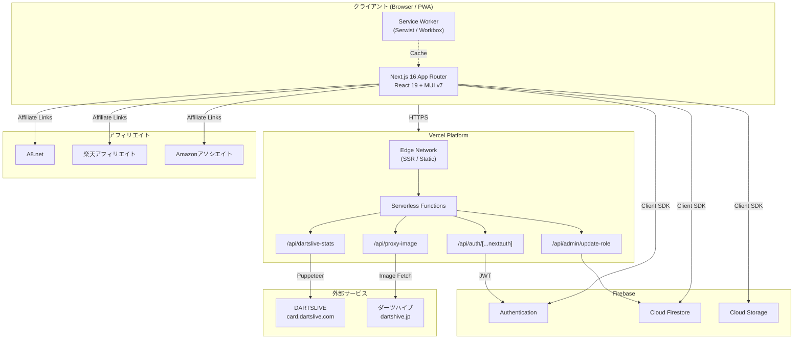
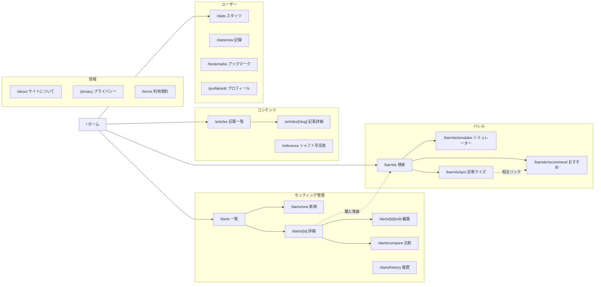
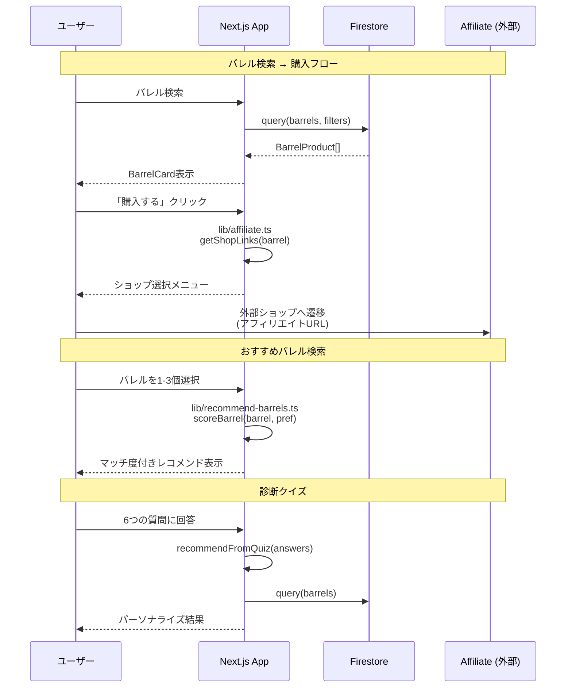
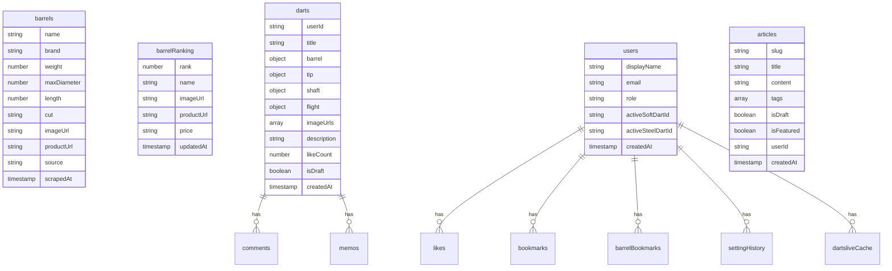
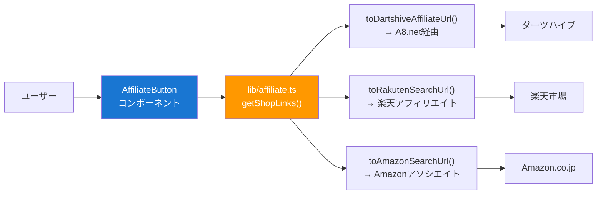

# Darts Lab - アーキテクチャ設計書

## 全体システム構成図



## ページ遷移図



## データフロー



## Firestore コレクション設計



## コンポーネント構成

```
components/
├── layout/                    # レイアウト
│   ├── Header.tsx             # AppBar + ナビ + ドロップダウンメニュー
│   ├── Footer.tsx             # 4カラムリッチフッター
│   ├── TwoColumnLayout.tsx    # PC: メイン+サイドバー / モバイル: 1カラム
│   ├── Sidebar.tsx            # 人気バレル・新着記事・ショップバナー
│   └── Breadcrumbs.tsx        # パンくずナビ
├── affiliate/                 # アフィリエイト
│   └── AffiliateButton.tsx    # 複数ショップドロップダウン購入ボタン
├── darts/                     # セッティング
│   ├── DartCard.tsx           # セッティングカード
│   ├── DartDetail.tsx         # セッティング詳細 + 購入導線
│   └── DartForm.tsx           # 登録・編集フォーム
├── barrels/                   # バレル
│   ├── BarrelCard.tsx         # バレル商品カード + アフィリエイトボタン
│   ├── BarrelSimulator.tsx    # SVGバレル形状シミュレーター
│   └── BarrelQuiz.tsx         # 6ステップ診断クイズ (MUI Stepper)
├── articles/                  # 記事
│   ├── ArticleCard.tsx        # 記事一覧カード
│   └── MarkdownContent.tsx    # Markdown レンダラー
├── comment/                   # コメント
│   ├── CommentForm.tsx
│   └── CommentList.tsx
├── UserAvatar.tsx             # DiceBear アバター
└── Providers.tsx              # SessionProvider + ThemeProvider
```

## 技術スタック詳細

| カテゴリ | 技術 | 用途 |
|---------|------|------|
| フレームワーク | Next.js 16 (App Router) | SSR/SSG + API Routes |
| 言語 | TypeScript 5 (strict) | 型安全なフルスタック開発 |
| UI | React 19 + MUI v7 | コンポーネントライブラリ |
| CSS | Tailwind CSS v4 | ユーティリティCSS |
| 認証 | NextAuth.js 4 + Firebase Auth | JWT + ロールベースアクセス制御 |
| データベース | Cloud Firestore | NoSQL リアルタイムDB |
| ストレージ | Firebase Storage | 画像アップロード |
| グラフ | Recharts 3 | スタッツ可視化 |
| スクレイピング | Puppeteer 24 | DARTSLIVE データ取得 |
| PWA | Serwist (@serwist/next) | Service Worker + キャッシュ戦略 |
| ホスティング | Vercel | Edge Network + Serverless |
| アフィリエイト | A8.net / 楽天 / Amazon | 収益化基盤 |

## 環境変数一覧

| 変数 | 種類 | 説明 |
|------|------|------|
| `NEXT_PUBLIC_FIREBASE_*` | 公開 | Firebase クライアントSDK設定 |
| `NEXTAUTH_SECRET` | 秘密 | JWT署名キー |
| `NEXTAUTH_URL` | 設定 | アプリURL |
| `ADMIN_EMAIL` | 設定 | 管理者メールアドレス |
| `FIREBASE_SERVICE_ACCOUNT_KEY` | 秘密 | Firebase Admin SDK キー |
| `NEXT_PUBLIC_RAKUTEN_AFFILIATE_ID` | 公開 | 楽天アフィリエイトID |
| `NEXT_PUBLIC_AMAZON_ASSOCIATE_TAG` | 公開 | Amazonアソシエイトタグ |
| `NEXT_PUBLIC_A8_MEDIA_ID` | 公開 | A8.net メディアID |

## アフィリエイトフロー



## セキュリティ設計

- **認証**: NextAuth.js JWT + Firebase Auth のデュアル認証
- **ロールベースアクセス制御**: admin / pro / general の3段階
- **Firebase セキュリティルール**: Firestore・Storage の読み書き制限
- **環境変数管理**: 秘密情報は `.env.local` に分離、Git管理外
- **DARTSLIVE連携**: 認証情報はセッション中のみサーバーサイドで処理、永続化しない
- **画像プロキシ**: ホワイトリスト方式（dartshive.jp, firebasestorage のみ許可）
- **アフィリエイトID**: クライアント公開（`NEXT_PUBLIC_`）だが、IDのみで秘密情報ではない
