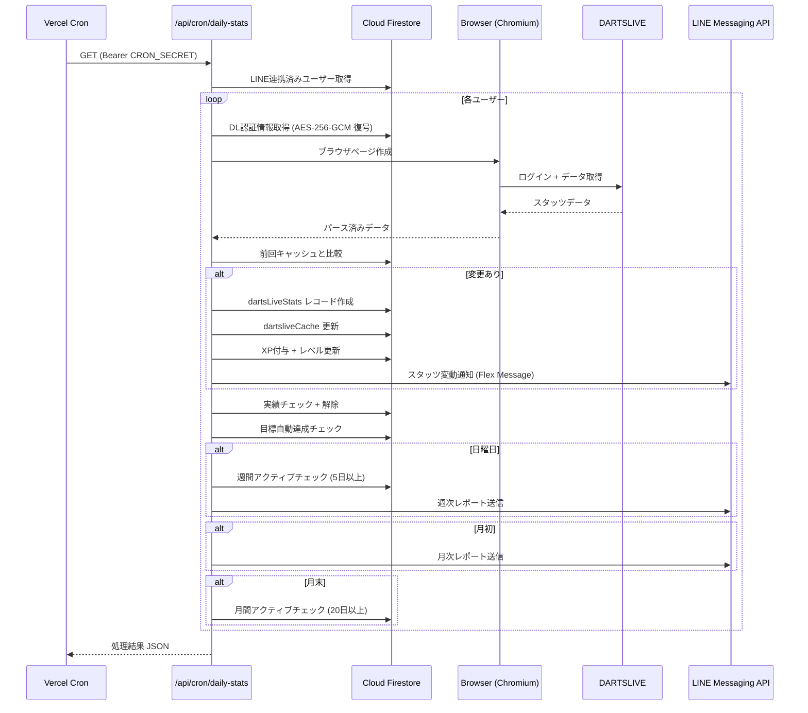

# 自動処理 (Cron Job)

## 概要

Vercel Cron を使用して日次バッチ処理を実行する。DARTSLIVE スタッツの自動取得、XP / 実績の付与、目標の自動達成判定、週次 / 月次レポートの LINE 配信を一括で行う。

## スケジュール

| ジョブ            | エンドポイント                 | スケジュール                 | タイムゾーン |
| ----------------- | ------------------------------ | ---------------------------- | ------------ |
| 日次スタッツ取得  | `/api/cron/daily-stats`        | `0 1 * * *` (毎日 01:00 UTC) | JST 10:00    |
| DARTSLIVE API同期 | `/api/cron/dartslive-api-sync` | `0 1 * * *` (毎日 01:00 UTC) | JST 10:00    |

```json
// vercel.json
{
  "crons": [
    {
      "path": "/api/cron/daily-stats",
      "schedule": "0 1 * * *"
    },
    {
      "path": "/api/cron/dartslive-api-sync",
      "schedule": "0 1 * * *"
    }
  ]
}
```

## 認証

Vercel Cron は `Authorization: Bearer <CRON_SECRET>` ヘッダーを付与してリクエストを送信する。

```
CRON_SECRET=<openssl rand -base64 32 で生成>
```

エンドポイント側で `Authorization` ヘッダーを検証し、不一致の場合は `401 Unauthorized` を返す。

## 処理フロー



## 処理詳細

### 1. 対象ユーザー選定

- `lineConversations` コレクションから LINE 連携済みユーザーを取得
- 各ユーザーの `users/{userId}` から暗号化された DARTSLIVE 認証情報（`dlCardNo`, `dlPassword`）を取得
- 認証情報は AES-256-GCM で暗号化・保存されており、バッチ実行時に復号

### 2. DARTSLIVE スタッツ取得

- サーバーサイドブラウザ自動化により DARTSLIVE にログインしデータを取得
- 取得データ: Rating, 01 Stats (PPD), Cricket Stats (MPR), COUNT-UP, ゲーム数, アワード（HAT TRICK, D-BULL, S-BULL 等）
- **共有ブラウザ**: 全ユーザーで 1 つの Chromium インスタンスを共有（ページは個別）

### 3. 差分検出 & データ保存

前回のキャッシュ (`dartsliveCache/latest`) と比較し、変更があった場合:

| 保存先                                 | 内容                                                             |
| -------------------------------------- | ---------------------------------------------------------------- |
| `users/{userId}/dartsLiveStats/{date}` | 日次スタッツレコード（Rating, PPD, MPR, CU, ゲーム数, ブル統計） |
| `users/{userId}/dartsliveCache/latest` | 最新キャッシュ + 前回比較データ + fullData JSON                  |

### 4. XP 自動付与

スタッツの差分に基づき XP を自動計算・付与:

| アクション       | XP   | 条件                         |
| ---------------- | ---- | ---------------------------- |
| スタッツ記録     | 5    | 変更検出時                   |
| レーティング上昇 | 10   | Rt が前回より上昇            |
| 連続プレイ       | 5-20 | 3日/7日/14日/30日連続        |
| 週間アクティブ   | 25   | 週5日以上プレイ（日曜判定）  |
| 月間アクティブ   | 100  | 月20日以上プレイ（月末判定） |

付与後、累計 XP からレベル・ランクを再計算して `users/{userId}` を更新。

### 5. 実績チェック

`lib/progression/achievements.ts` に定義された 12 種の実績条件をチェック:

- 初スタッツ記録、ゲーム数マイルストーン、Rating 到達、HAT TRICK 到達 等
- 新規解除時: 10 XP 付与 + LINE 通知 + `notifications` サブコレクションに保存

### 6. 目標自動達成

`users/{userId}/goals` の未達成目標を走査:

- 月間目標: DARTSLIVE の「今月」値を直接使用（ブル数、HAT TRICK）
- 期間目標: `dartsLiveStats` レコードから期間内の変動を計算
- `current >= target` の場合: スケーリング XP 付与 + 目標ドキュメント削除 + 通知

### 7. 週次 / 月次レポート

| レポート | 配信タイミング         | 内容                                            |
| -------- | ---------------------- | ----------------------------------------------- |
| 週次     | 毎週日曜 (Cron 実行時) | 前週のプレイ日数・ゲーム数・Rt変動 + 前々週比較 |
| 月次     | 毎月1日 (Cron 実行時)  | 前月のサマリー + 前々月比較                     |

LINE Flex Message で送信。`gatherPeriodReport()` で期間内の `dartsLiveStats` を集計。

## 更新される Firestore コレクション

| コレクション                           | 操作 | 内容                                         |
| -------------------------------------- | ---- | -------------------------------------------- |
| `users/{userId}/dartsLiveStats/{date}` | 作成 | 日次スタッツレコード                         |
| `users/{userId}/dartsliveCache/latest` | 更新 | 最新キャッシュ + 比較データ                  |
| `users/{userId}`                       | 更新 | XP, level, rank, achievements, highestRating |
| `users/{userId}/xpHistory`             | 作成 | XP 付与ログ                                  |
| `users/{userId}/notifications`         | 作成 | 通知（実績解除、目標達成）                   |
| `users/{userId}/goals/{goalId}`        | 削除 | 自動達成した目標                             |
| `lineConversations/{lineUserId}`       | 更新 | 会話状態を `waiting_condition` に            |

## エラーハンドリング

- 各ユーザーの処理は `try-catch` で独立しており、1 ユーザーの失敗が他に影響しない
- 全体の結果を JSON で返却（ユーザーごとに `success` / `no_change` / `error` ステータス）
- エラーは `console.error` + Sentry で捕捉

## ローカル実行

開発環境でテストする場合:

```bash
curl -X GET http://localhost:3000/api/cron/daily-stats \
  -H "Authorization: Bearer $CRON_SECRET"
```

**注意**: サーバーサイドブラウザ自動化を含むため、ローカル実行には Chromium が必要。Vercel 上では `@sparticuz/chromium` を使用。
